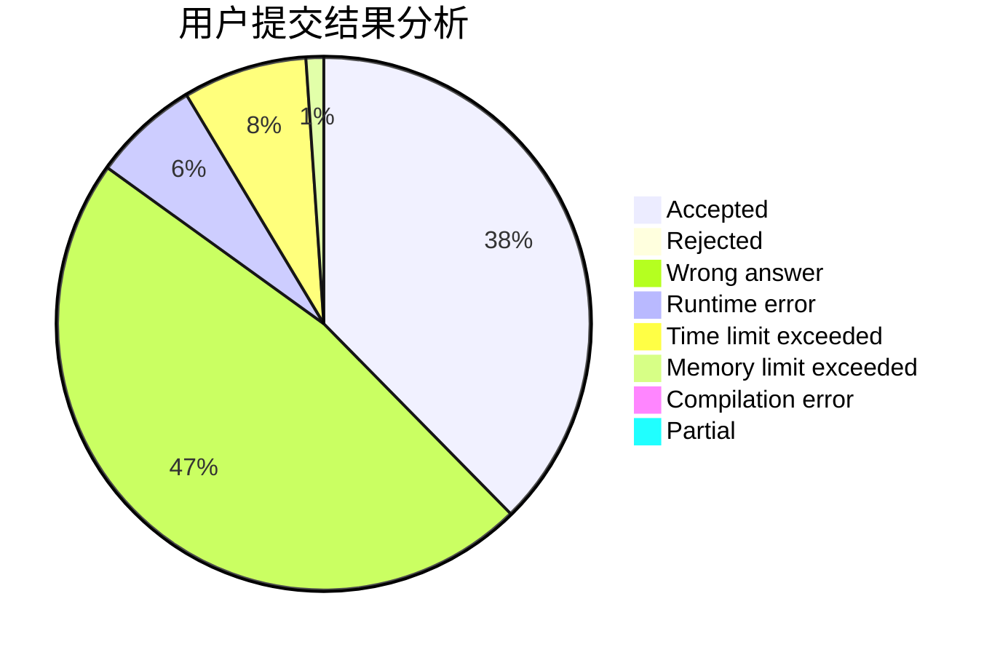
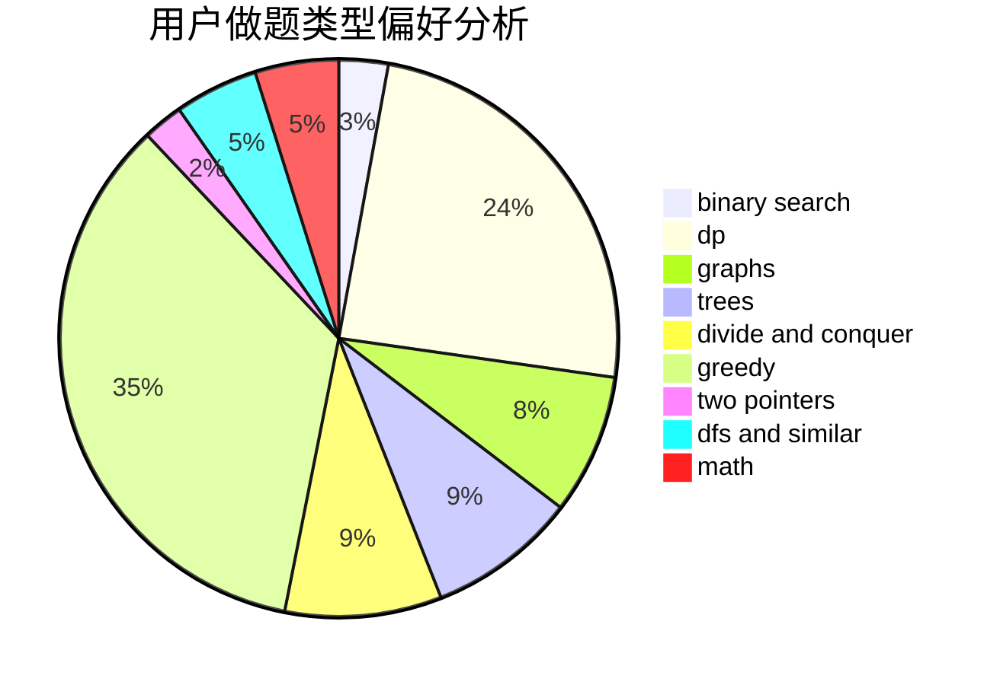

# hyy-hhh-hyy

<!-- tabs:start -->

#### **用户提交结果分析**

#### **用户做题类型偏好分析**

<!-- tabs:end -->
# 推荐题目
[982A](https://codeforces.com/contest/982/problem/A)
[723D](https://codeforces.com/contest/723/problem/D)
[911B](https://codeforces.com/contest/911/problem/B)
[39C](https://codeforces.com/contest/39/problem/C)
[1101G](https://codeforces.com/contest/1101/problem/G)
[11652](https://codeforces.com/contest/1165/problem/2)
[597B](https://codeforces.com/contest/597/problem/B)
[1087E](https://codeforces.com/contest/1087/problem/E)
[876F](https://codeforces.com/contest/876/problem/F)
[354D](https://codeforces.com/contest/354/problem/D)
