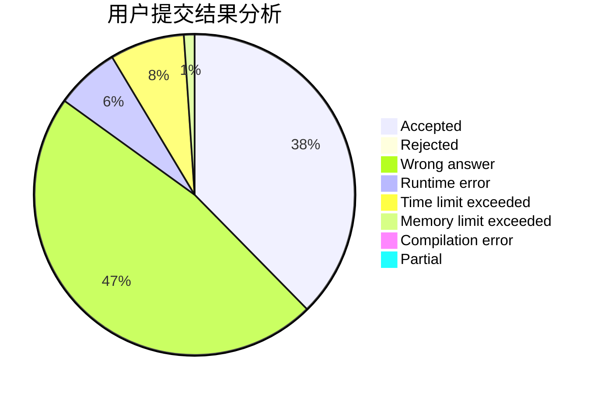
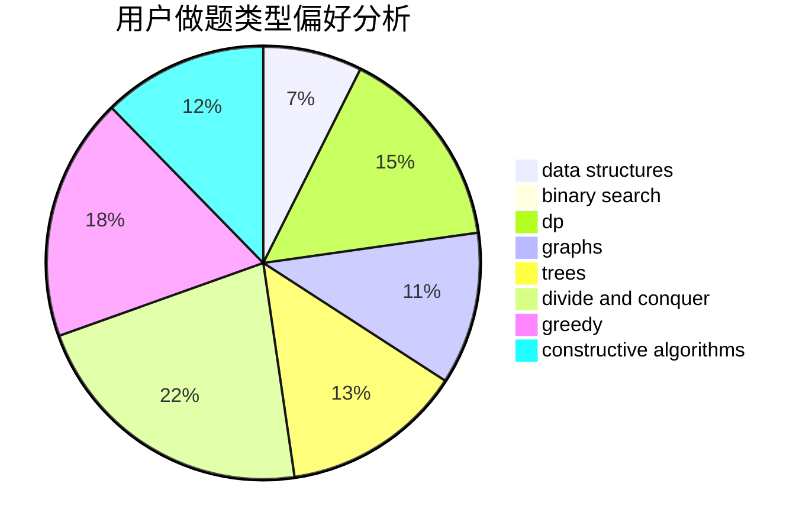
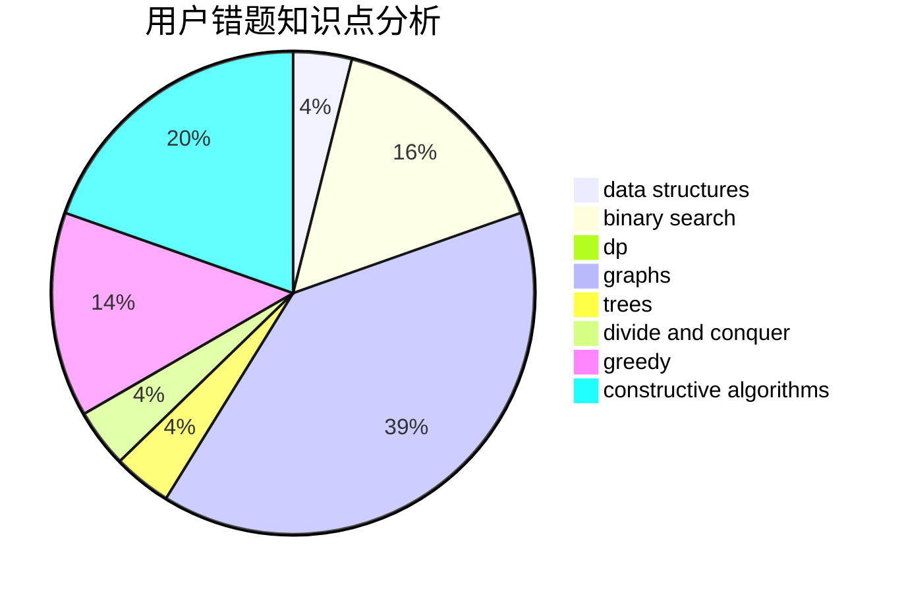

# hyy-hhh-hyy

<!-- tabs:start -->

#### **用户提交结果分析**

#### **用户做题类型偏好分析**

#### **用户错题知识点分析**

<!-- tabs:end -->
# 推荐题目
[982A](https://codeforces.com/contest/982/problem/A)		brute force,
                        constructive algorithms		  
[723D](https://codeforces.com/contest/723/problem/D)		dfs and similar,
                        dsu,
                        graphs,
                        greedy,
                        implementation		  
[911B](https://codeforces.com/contest/911/problem/B)		binary search,
                        brute force,
                        implementation		  
[39C](https://codeforces.com/contest/39/problem/C)		dp,
                        sortings		  
[1101G](https://codeforces.com/contest/1101/problem/G)		math,
                        matrices		  
[11652](https://codeforces.com/contest/1165/problem/2)		dsu,graphs,sortings,trees		  
[597B](https://codeforces.com/contest/597/problem/B)		dp,
                        greedy,
                        sortings		  
[1087E](https://codeforces.com/contest/1087/problem/E)		dsu,graphs,sortings,trees		  
[876F](https://codeforces.com/contest/876/problem/F)		dsu,graphs,sortings,trees		  
[354D](https://codeforces.com/contest/354/problem/D)		dp		  
