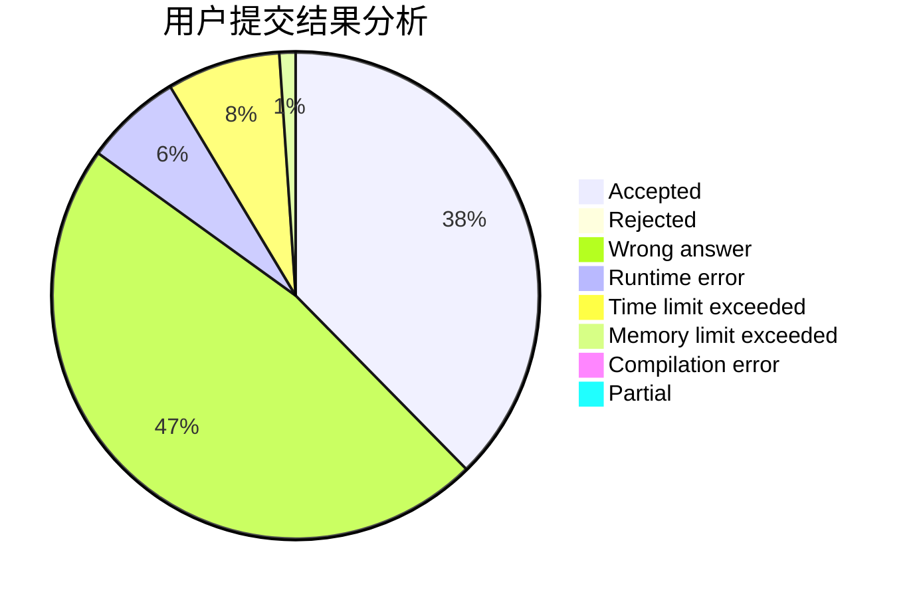
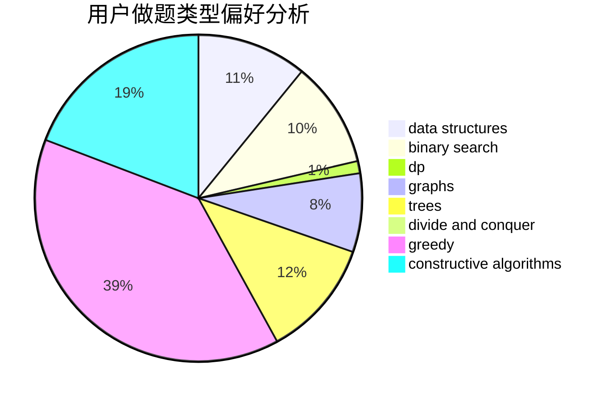
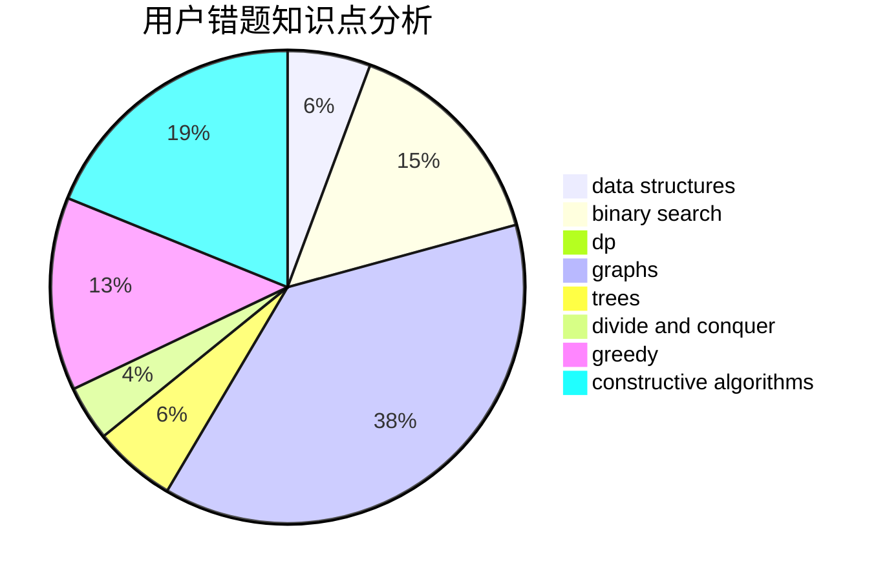

# hyy-hhh-hyy

<!-- tabs:start -->

#### **用户提交结果分析**

#### **用户做题类型偏好分析**

#### **用户错题知识点分析**

<!-- tabs:end -->
# 推荐题目
[960B](https://codeforces.com/contest/960/problem/B)		data structures,
                        greedy,
                        sortings		  
[704D](https://codeforces.com/contest/704/problem/D)		flows,
                        greedy		  
[893B](https://codeforces.com/contest/893/problem/B)		brute force,
                        implementation		  
[369A](https://codeforces.com/contest/369/problem/A)		greedy,
                        implementation		  
[1101D](https://codeforces.com/contest/1101/problem/D)		data structures,
                        dfs and similar,
                        dp,
                        number theory,
                        trees		  
[1163D](https://codeforces.com/contest/1163/problem/D)		dp,
                        strings		  
[575G](https://codeforces.com/contest/575/problem/G)		dfs and similar,
                        shortest paths		  
[1087B](https://codeforces.com/contest/1087/problem/B)		dsu,graphs,sortings,trees		  
[859B](https://codeforces.com/contest/859/problem/B)		brute force,
                        geometry,
                        math		  
[325C](https://codeforces.com/contest/325/problem/C)		dfs and similar,
                        graphs,
                        shortest paths		  
