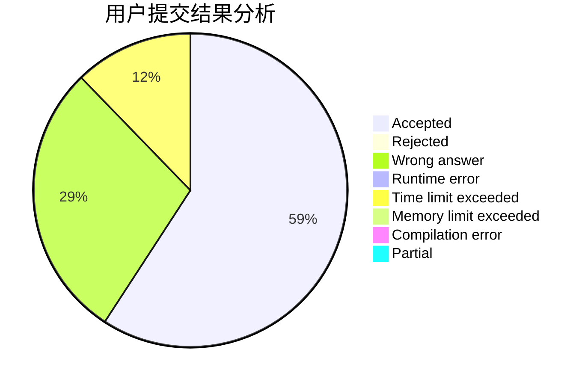
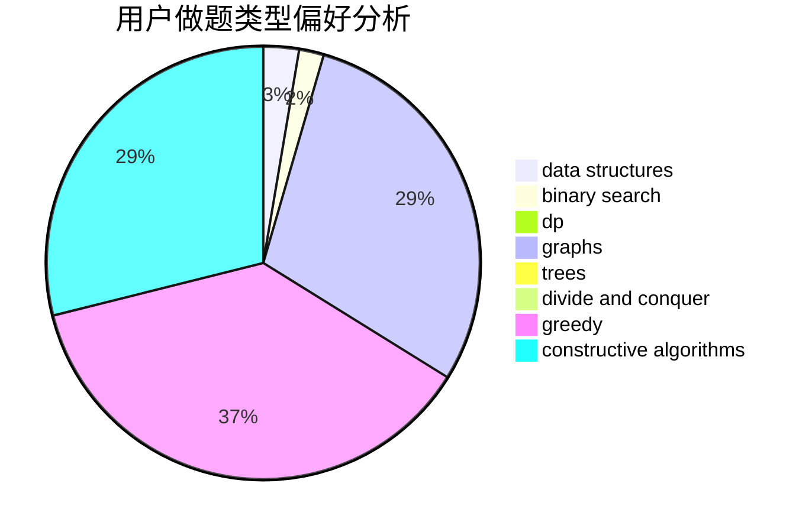
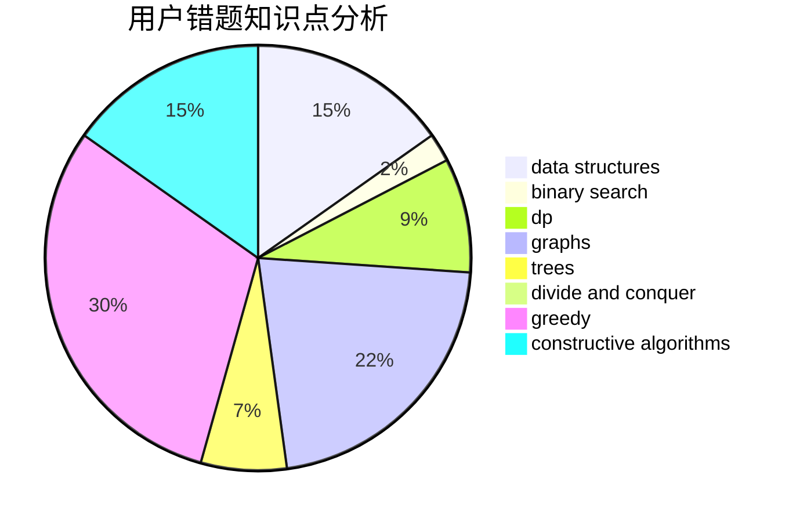

# hzkmd

<!-- tabs:start -->

#### **用户提交结果分析**

#### **用户做题类型偏好分析**

#### **用户错题知识点分析**

<!-- tabs:end -->
# 推荐题目
[1358D](https://codeforces.com/contest/1358/problem/D)		binary search,
                        brute force,
                        greedy,
                        implementation,
                        two pointers		  
[795K](https://codeforces.com/contest/795/problem/K)		dsu,graphs,sortings,trees		  
[576E](https://codeforces.com/contest/576/problem/E)		binary search,
                        data structures		  
[959B](https://codeforces.com/contest/959/problem/B)		dsu,
                        greedy,
                        implementation		  
[220B](https://codeforces.com/contest/220/problem/B)		constructive algorithms,
                        data structures		  
[1083F](https://codeforces.com/contest/1083/problem/F)		data structures		  
[853C](https://codeforces.com/contest/853/problem/C)		data structures		  
[1505C](https://codeforces.com/contest/1505/problem/C)		implementation		  
[1513E](https://codeforces.com/contest/1513/problem/E)		combinatorics,
                        constructive algorithms,
                        math,
                        sortings		  
[1341F](https://codeforces.com/contest/1341/problem/F)		dsu,graphs,sortings,trees		  
