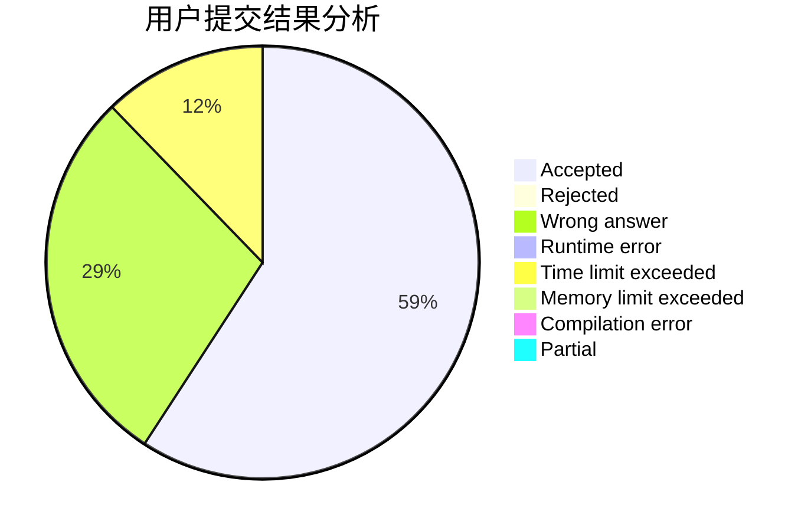
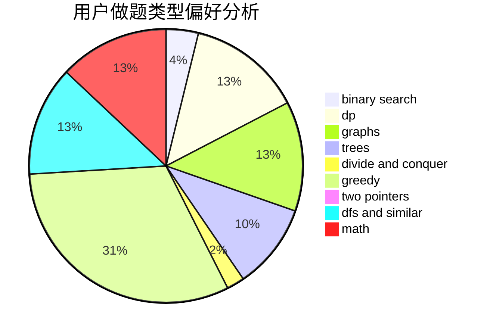

# hzkmd

<!-- tabs:start -->

#### **用户提交结果分析**

#### **用户做题类型偏好分析**

<!-- tabs:end -->
# 推荐题目
[1366F](https://codeforces.com/contest/1366/problem/F)
[810A](https://codeforces.com/contest/810/problem/A)
[598E](https://codeforces.com/contest/598/problem/E)
[981A](https://codeforces.com/contest/981/problem/A)
[23C](https://codeforces.com/contest/23/problem/C)
[1084D](https://codeforces.com/contest/1084/problem/D)
[871E](https://codeforces.com/contest/871/problem/E)
[152D](https://codeforces.com/contest/152/problem/D)
[173E](https://codeforces.com/contest/173/problem/E)
[1348F](https://codeforces.com/contest/1348/problem/F)
