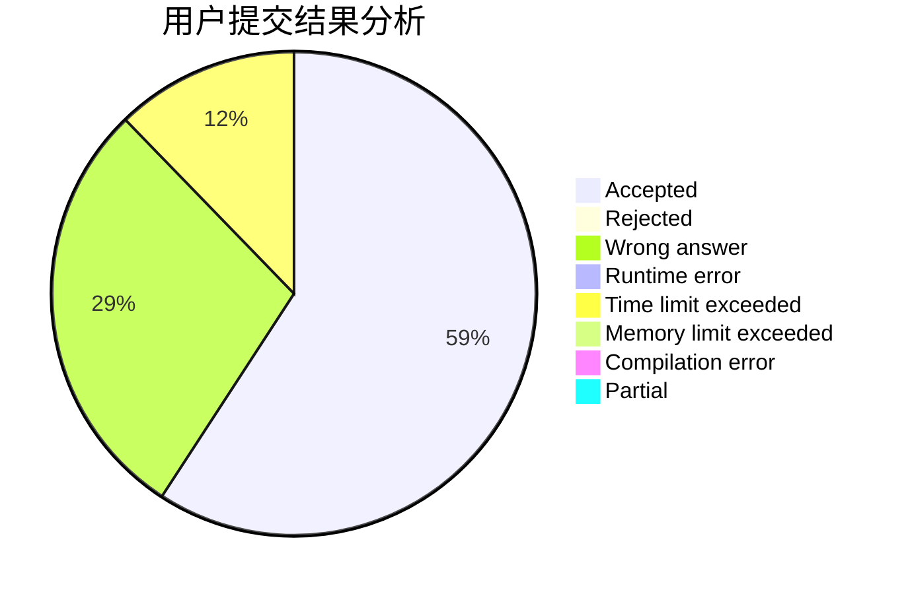
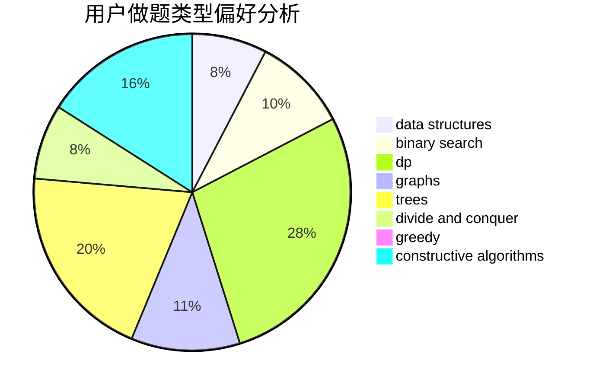
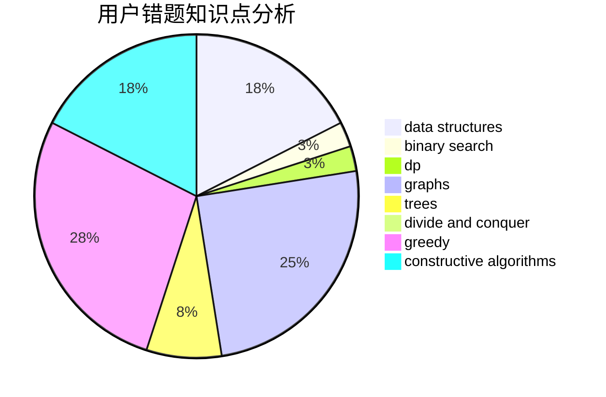

# hzkmd

<!-- tabs:start -->

#### **用户提交结果分析**

#### **用户做题类型偏好分析**

#### **用户错题知识点分析**

<!-- tabs:end -->
# 推荐题目
[1366F](https://codeforces.com/contest/1366/problem/F)		binary search,
                        dp,
                        geometry,
                        graphs		  
[810A](https://codeforces.com/contest/810/problem/A)		implementation,
                        math		  
[598E](https://codeforces.com/contest/598/problem/E)		brute force,
                        dp		  
[981A](https://codeforces.com/contest/981/problem/A)		brute force,
                        implementation,
                        strings		  
[23C](https://codeforces.com/contest/23/problem/C)		constructive algorithms,
                        sortings		  
[1084D](https://codeforces.com/contest/1084/problem/D)		dsu,graphs,sortings,trees		  
[871E](https://codeforces.com/contest/871/problem/E)		graphs,
                        greedy,
                        trees		  
[152D](https://codeforces.com/contest/152/problem/D)		brute force		  
[173E](https://codeforces.com/contest/173/problem/E)		data structures,
                        sortings		  
[1348F](https://codeforces.com/contest/1348/problem/F)		data structures,
                        dfs and similar,
                        graphs,
                        greedy		  
