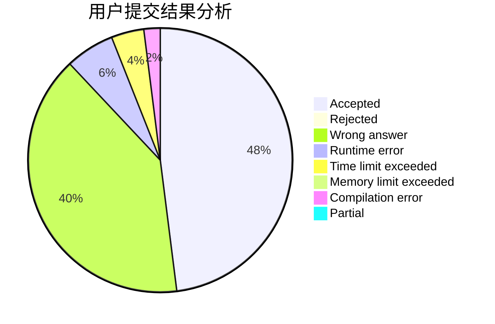
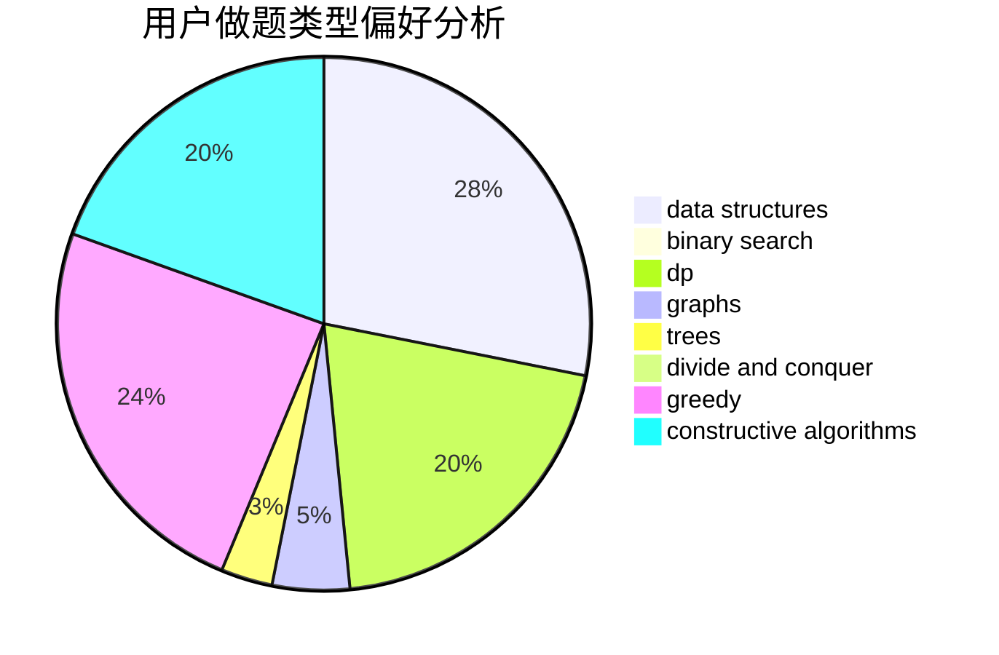

# hzoi-MAFIA

<!-- tabs:start -->

#### **用户提交结果分析**

#### **用户做题类型偏好分析**

#### **用户错题知识点分析**

<!-- tabs:end -->
# 推荐题目
[963C](https://codeforces.com/contest/963/problem/C)		brute force,
                        math,
                        number theory		  
[359C](https://codeforces.com/contest/359/problem/C)		math,
                        number theory		  
[1316F](https://codeforces.com/contest/1316/problem/F)		data structures,
                        divide and conquer,
                        probabilities		  
[888C](https://codeforces.com/contest/888/problem/C)		binary search,
                        implementation,
                        two pointers		  
[1347E](https://codeforces.com/contest/1347/problem/E)		dsu,graphs,sortings,trees		  
[985E](https://codeforces.com/contest/985/problem/E)		binary search,
                        data structures,
                        dp,
                        greedy,
                        two pointers		  
[482E](https://codeforces.com/contest/482/problem/E)		data structures,
                        trees		  
[281D](https://codeforces.com/contest/281/problem/D)		dsu,graphs,sortings,trees		  
[471D](https://codeforces.com/contest/471/problem/D)		string suffix structures,
                        strings		  
[545B](https://codeforces.com/contest/545/problem/B)		greedy		  
