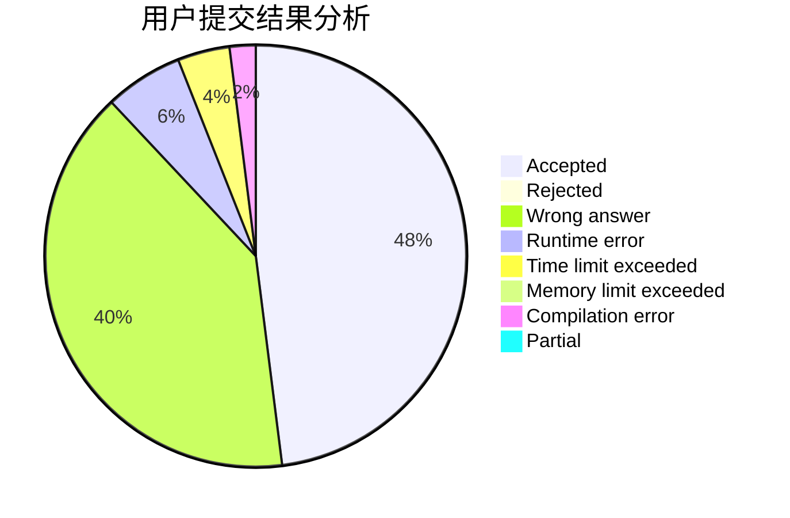
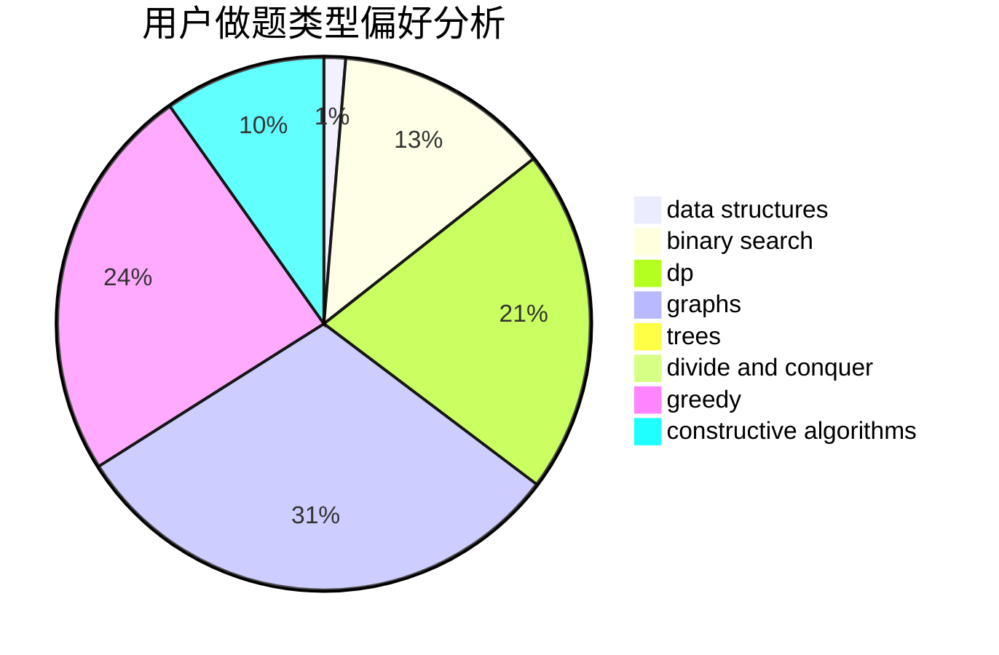
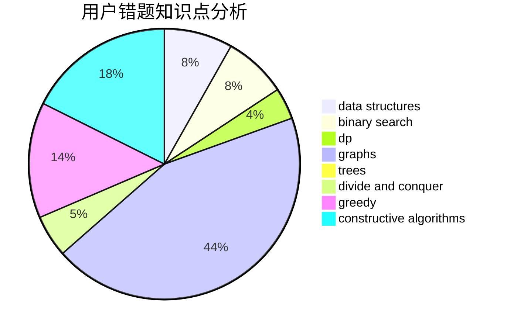

# hzoi-MAFIA

<!-- tabs:start -->

#### **用户提交结果分析**

#### **用户做题类型偏好分析**

#### **用户错题知识点分析**

<!-- tabs:end -->
# 推荐题目
[946F](https://codeforces.com/contest/946/problem/F)		combinatorics,
                        dp,
                        matrices		  
[331C3](https://codeforces.com/contest/331C/problem/3)		dp		  
[1310C](https://codeforces.com/contest/1310/problem/C)		binary search,
                        dp,
                        strings		  
[868G](https://codeforces.com/contest/868/problem/G)		math		  
[1340F](https://codeforces.com/contest/1340/problem/F)		brute force,
                        data structures,
                        hashing		  
[962G](https://codeforces.com/contest/962/problem/G)		data structures,
                        dsu,
                        geometry,
                        trees		  
[463A](https://codeforces.com/contest/463/problem/A)		brute force,
                        implementation		  
[266A](https://codeforces.com/contest/266/problem/A)		implementation		  
[44E](https://codeforces.com/contest/44/problem/E)		dp		  
[51A](https://codeforces.com/contest/51/problem/A)		implementation		  
