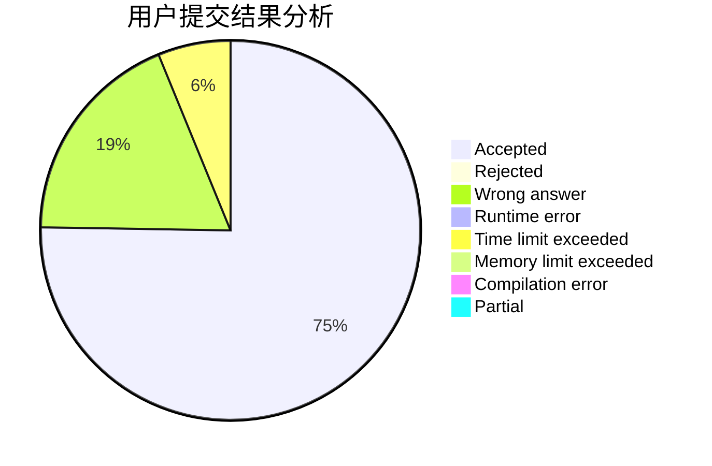
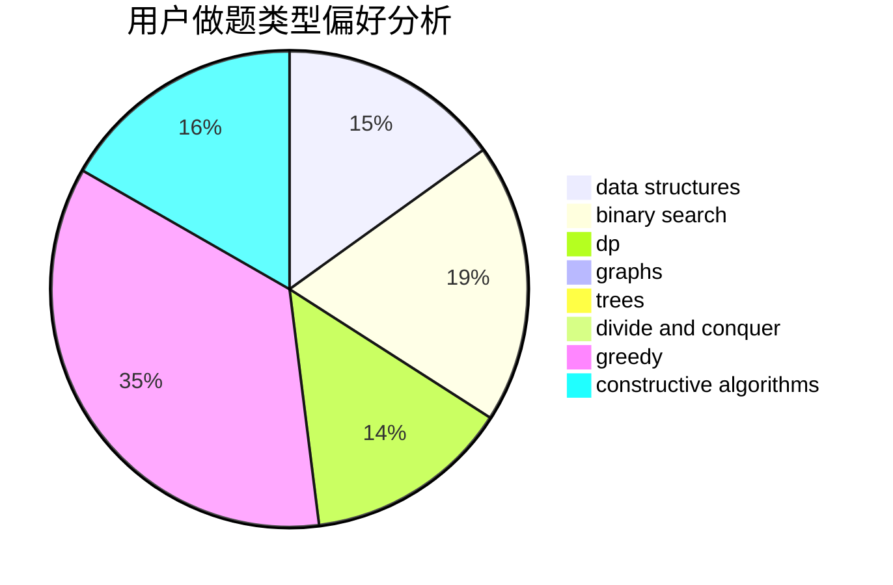

# Baylor_

<!-- tabs:start -->

#### **用户提交结果分析**

#### **用户做题类型偏好分析**

#### **用户错题知识点分析**

<!-- tabs:end -->
# 推荐题目
[1434E](https://codeforces.com/contest/1434/problem/E)		dsu,
                        games		  
[490B](https://codeforces.com/contest/490/problem/B)		dsu,
                        implementation		  
[1487A](https://codeforces.com/contest/1487/problem/A)		implementation,
                        sortings		  
[1398B](https://codeforces.com/contest/1398/problem/B)		games,
                        greedy,
                        sortings		  
[12B](https://codeforces.com/contest/12/problem/B)		implementation,
                        sortings		  
[273E](https://codeforces.com/contest/273/problem/E)		dp,
                        games		  
[494E](https://codeforces.com/contest/494/problem/E)		data structures,
                        games		  
[494B](https://codeforces.com/contest/494/problem/B)		dp,
                        strings		  
[205B](https://codeforces.com/contest/205/problem/B)		brute force,
                        greedy		  
[1068A](https://codeforces.com/contest/1068/problem/A)		math		  
