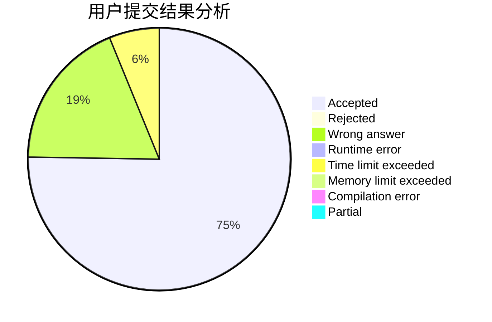
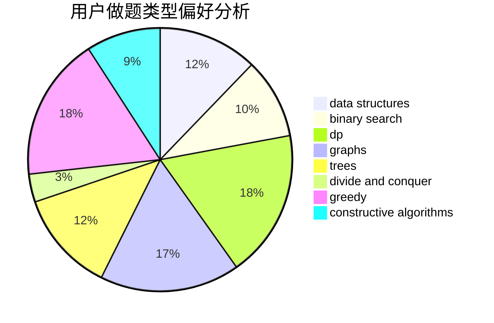

# Baylor_

<!-- tabs:start -->

#### **用户提交结果分析**

#### **用户做题类型偏好分析**

#### **用户错题知识点分析**

<!-- tabs:end -->
# 推荐题目
[1444E](https://codeforces.com/contest/1444/problem/E)		brute force,
                        dfs and similar,
                        dp,
                        interactive,
                        trees		  
[510C](https://codeforces.com/contest/510/problem/C)		dfs and similar,
                        graphs,
                        sortings		  
[1494D](https://codeforces.com/contest/1494/problem/D)		constructive algorithms,
                        data structures,
                        dfs and similar,
                        divide and conquer,
                        dsu,
                        greedy,
                        sortings,
                        trees		  
[1407A](https://codeforces.com/contest/1407/problem/A)		constructive algorithms,
                        math		  
[1307C](https://codeforces.com/contest/1307/problem/C)		brute force,
                        dp,
                        math,
                        strings		  
[289D](https://codeforces.com/contest/289/problem/D)		dsu,graphs,sortings,trees		  
[515A](https://codeforces.com/contest/515/problem/A)		math		  
[514C](https://codeforces.com/contest/514/problem/C)		binary search,
                        data structures,
                        hashing,
                        string suffix structures,
                        strings		  
[229D](https://codeforces.com/contest/229/problem/D)		dp,
                        greedy,
                        two pointers		  
[1068D](https://codeforces.com/contest/1068/problem/D)		dsu,graphs,sortings,trees		  
