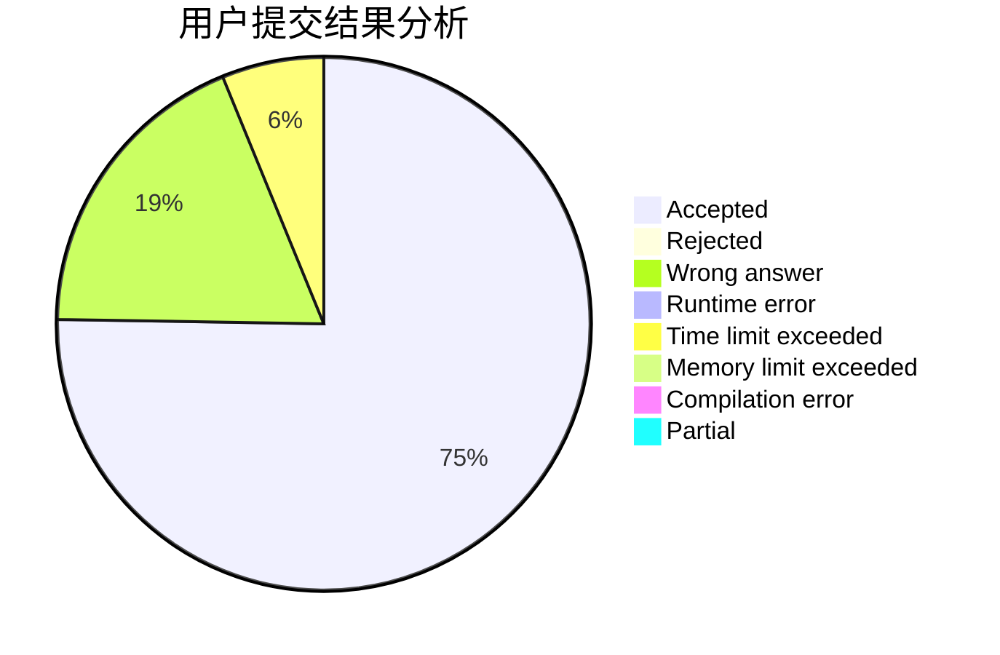
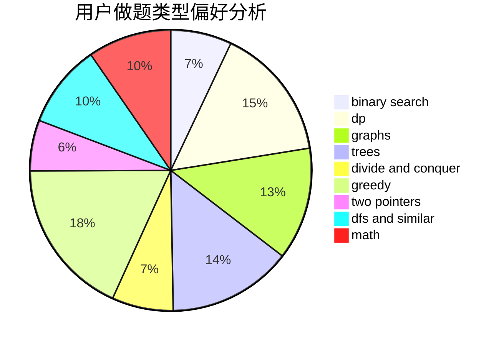

# Baylor_

<!-- tabs:start -->

#### **用户提交结果分析**

#### **用户做题类型偏好分析**

<!-- tabs:end -->
# 推荐题目
[1444E](https://codeforces.com/contest/1444/problem/E)
[510C](https://codeforces.com/contest/510/problem/C)
[1494D](https://codeforces.com/contest/1494/problem/D)
[1407A](https://codeforces.com/contest/1407/problem/A)
[1307C](https://codeforces.com/contest/1307/problem/C)
[289D](https://codeforces.com/contest/289/problem/D)
[515A](https://codeforces.com/contest/515/problem/A)
[514C](https://codeforces.com/contest/514/problem/C)
[229D](https://codeforces.com/contest/229/problem/D)
[1068D](https://codeforces.com/contest/1068/problem/D)
