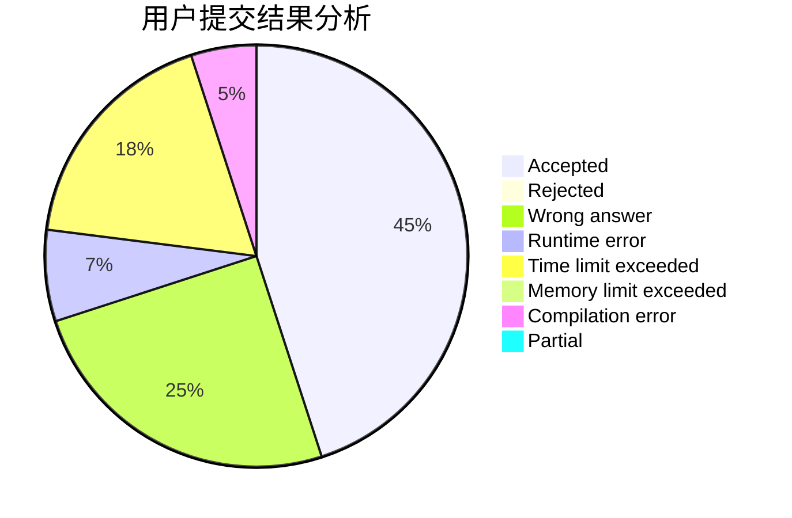
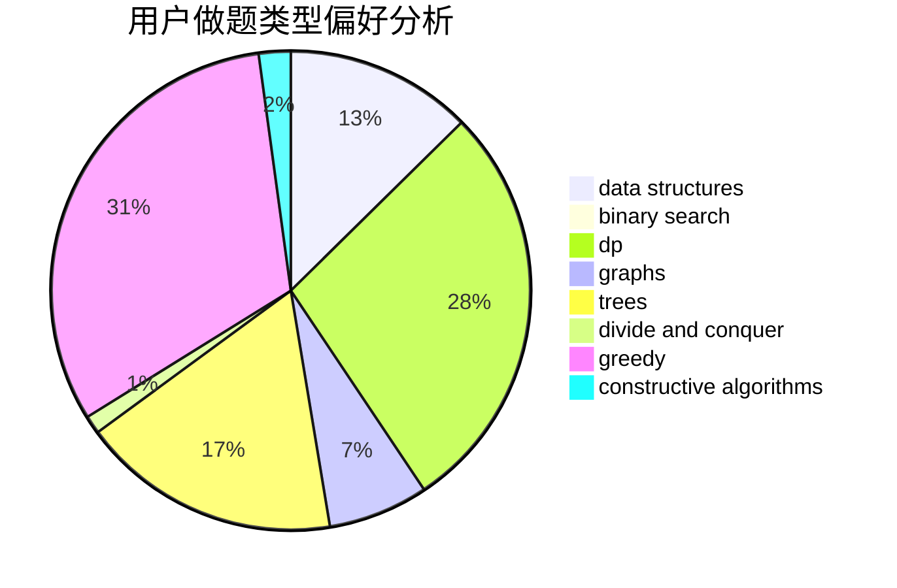
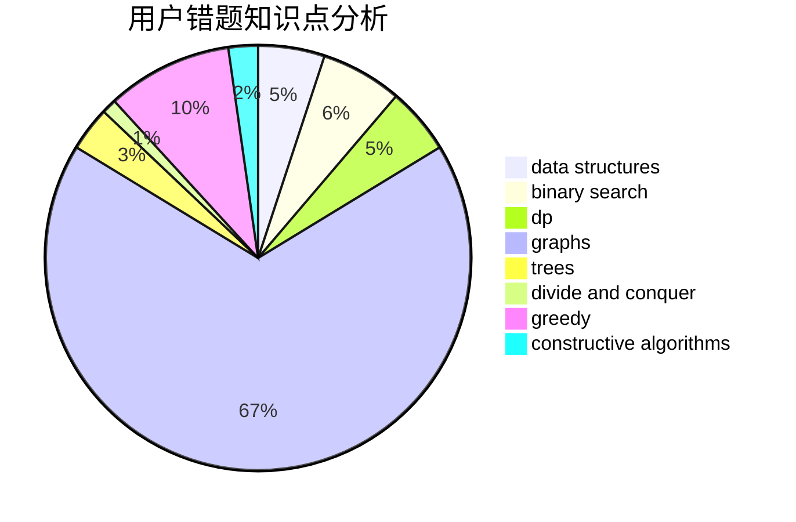

# hzoiliuchang2

<!-- tabs:start -->

#### **用户提交结果分析**

#### **用户做题类型偏好分析**

#### **用户错题知识点分析**

<!-- tabs:end -->
# 推荐题目
[638C](https://codeforces.com/contest/638/problem/C)		*special problem,
                        dfs and similar,
                        graphs,
                        greedy,
                        trees		  
[1391B](https://codeforces.com/contest/1391/problem/B)		brute force,
                        greedy,
                        implementation		  
[547A](https://codeforces.com/contest/547/problem/A)		brute force,
                        greedy,
                        implementation,
                        math		  
[455E](https://codeforces.com/contest/455/problem/E)		data structures		  
[121D](https://codeforces.com/contest/121/problem/D)		binary search,
                        implementation,
                        two pointers		  
[37B](https://codeforces.com/contest/37/problem/B)		greedy,
                        implementation		  
[1471D](https://codeforces.com/contest/1471/problem/D)		dsu,graphs,sortings,trees		  
[271A](https://codeforces.com/contest/271/problem/A)		brute force		  
[729A](https://codeforces.com/contest/729/problem/A)		implementation,
                        strings		  
[730J](https://codeforces.com/contest/730/problem/J)		dp		  
