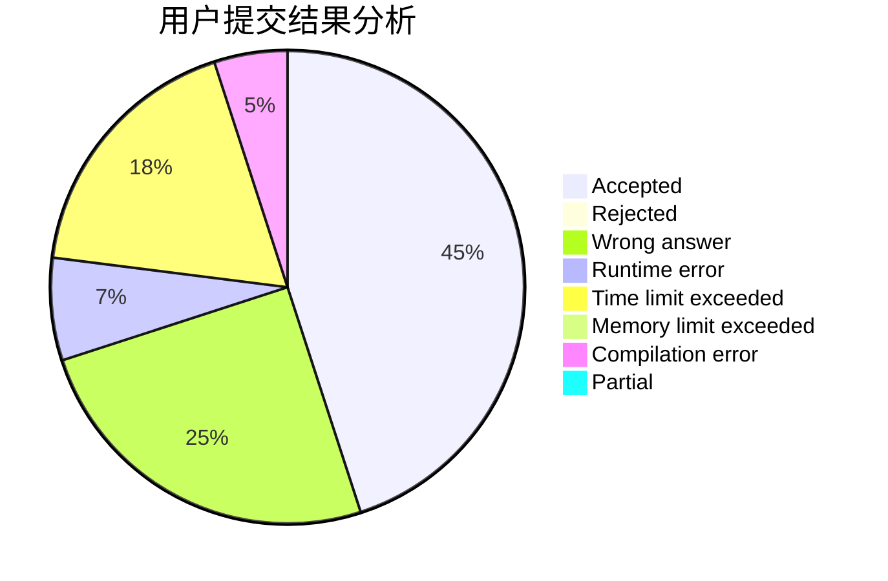
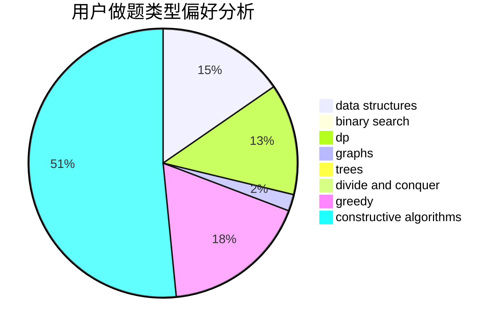
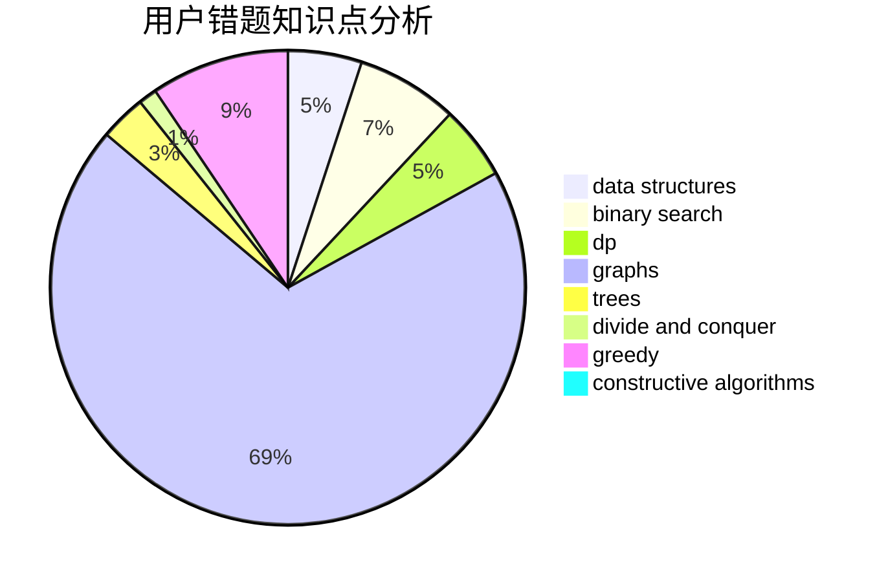

# hzoiliuchang2

<!-- tabs:start -->

#### **用户提交结果分析**

#### **用户做题类型偏好分析**

#### **用户错题知识点分析**

<!-- tabs:end -->
# 推荐题目
[668C](https://codeforces.com/contest/668/problem/C)		dsu,graphs,sortings,trees		  
[1399F](https://codeforces.com/contest/1399/problem/F)		data structures,
                        dp,
                        graphs,
                        sortings		  
[571C](https://codeforces.com/contest/571/problem/C)		constructive algorithms,
                        dfs and similar,
                        graphs,
                        greedy		  
[477A](https://codeforces.com/contest/477/problem/A)		dsu,graphs,sortings,trees		  
[1227B](https://codeforces.com/contest/1227/problem/B)		constructive algorithms		  
[409G](https://codeforces.com/contest/409/problem/G)		*special problem,
                        geometry		  
[147B](https://codeforces.com/contest/147/problem/B)		binary search,
                        graphs,
                        matrices		  
[287C](https://codeforces.com/contest/287/problem/C)		dsu,graphs,sortings,trees		  
[746A](https://codeforces.com/contest/746/problem/A)		implementation,
                        math		  
[749A](https://codeforces.com/contest/749/problem/A)		greedy,
                        implementation,
                        math,
                        number theory		  
