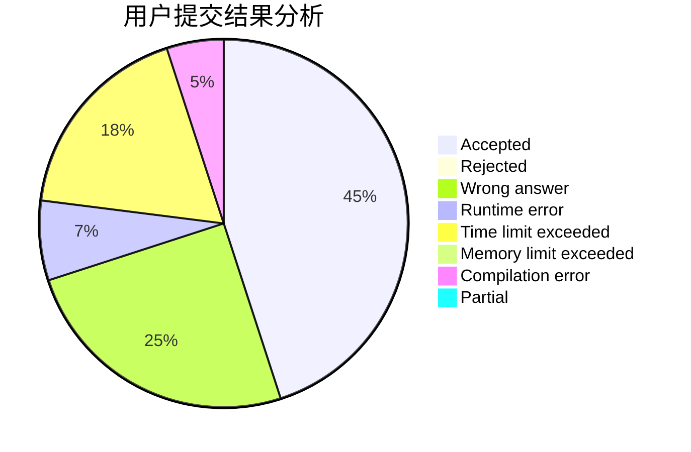
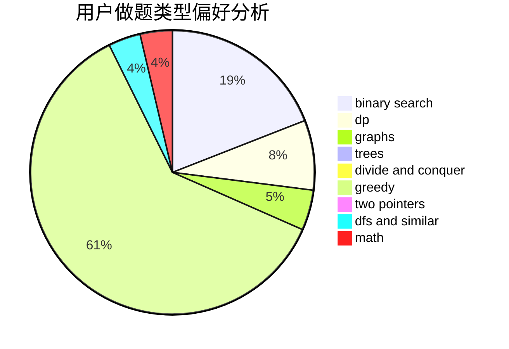

# hzoiliuchang2

<!-- tabs:start -->

#### **用户提交结果分析**

#### **用户做题类型偏好分析**

<!-- tabs:end -->
# 推荐题目
[668C](https://codeforces.com/contest/668/problem/C)
[1399F](https://codeforces.com/contest/1399/problem/F)
[571C](https://codeforces.com/contest/571/problem/C)
[477A](https://codeforces.com/contest/477/problem/A)
[1227B](https://codeforces.com/contest/1227/problem/B)
[409G](https://codeforces.com/contest/409/problem/G)
[147B](https://codeforces.com/contest/147/problem/B)
[287C](https://codeforces.com/contest/287/problem/C)
[746A](https://codeforces.com/contest/746/problem/A)
[749A](https://codeforces.com/contest/749/problem/A)
