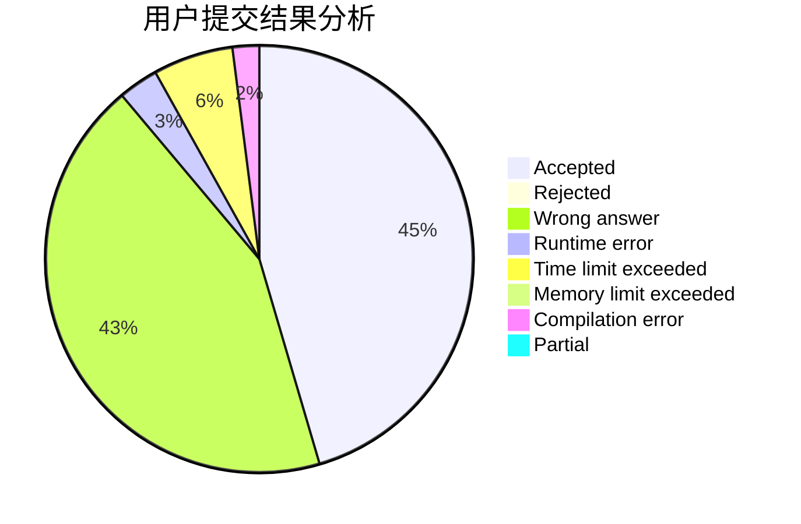
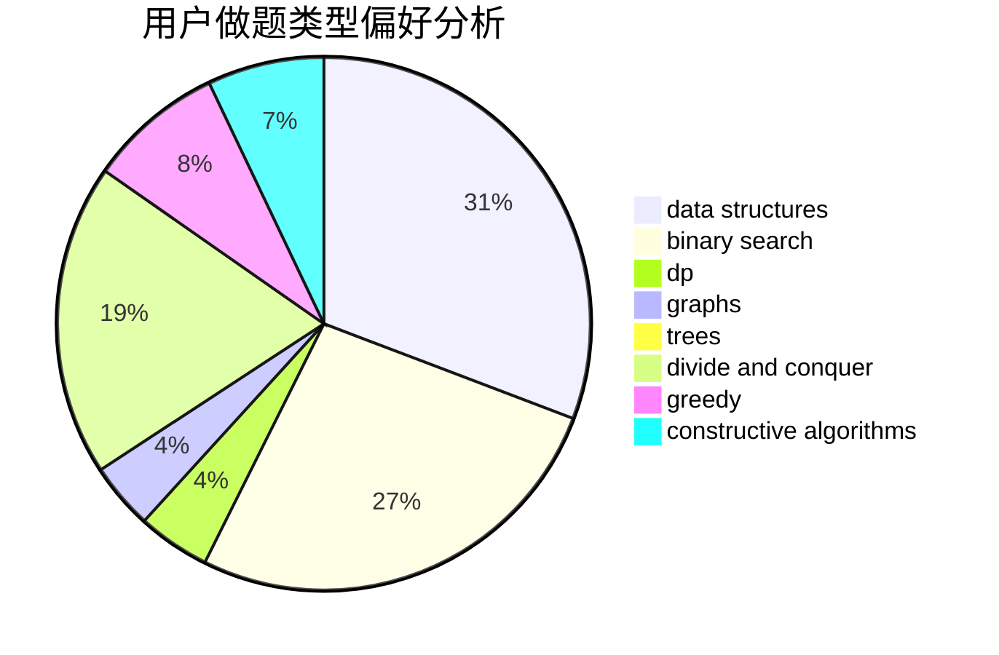
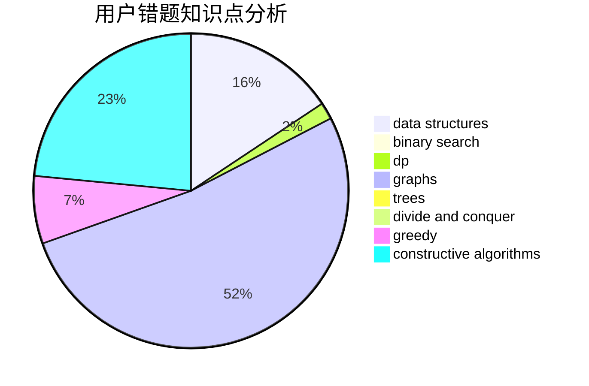

# hzt1

<!-- tabs:start -->

#### **用户提交结果分析**

#### **用户做题类型偏好分析**

#### **用户错题知识点分析**

<!-- tabs:end -->
# 推荐题目
[377A](https://codeforces.com/contest/377/problem/A)		dfs and similar		  
[370A](https://codeforces.com/contest/370/problem/A)		graphs,
                        math,
                        shortest paths		  
[1034D](https://codeforces.com/contest/1034/problem/D)		binary search,
                        data structures,
                        two pointers		  
[865B](https://codeforces.com/contest/865/problem/B)		binary search,
                        sortings,
                        ternary search		  
[601A](https://codeforces.com/contest/601/problem/A)		graphs,
                        shortest paths		  
[804B](https://codeforces.com/contest/804/problem/B)		combinatorics,
                        greedy,
                        implementation,
                        math		  
[443A](https://codeforces.com/contest/443/problem/A)		constructive algorithms,
                        implementation		  
[1040B](https://codeforces.com/contest/1040/problem/B)		dp,
                        greedy,
                        math		  
[1215B](https://codeforces.com/contest/1215/problem/B)		combinatorics,
                        dp,
                        implementation		  
[691F](https://codeforces.com/contest/691/problem/F)		brute force,
                        dp,
                        number theory		  
