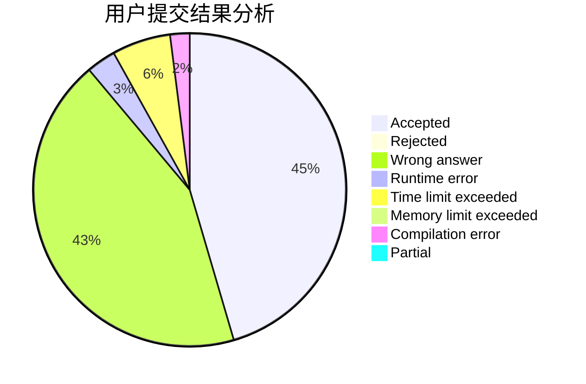
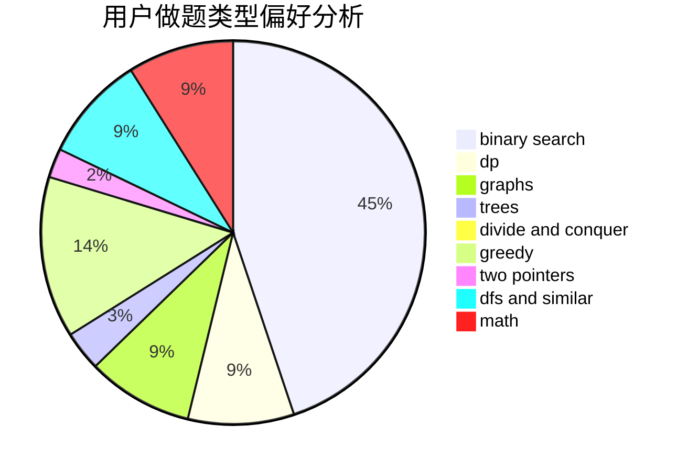

# hzt1

<!-- tabs:start -->

#### **用户提交结果分析**

#### **用户做题类型偏好分析**

<!-- tabs:end -->
# 推荐题目
[405B](https://codeforces.com/contest/405/problem/B)
[3C](https://codeforces.com/contest/3/problem/C)
[1036B](https://codeforces.com/contest/1036/problem/B)
[884F](https://codeforces.com/contest/884/problem/F)
[620C](https://codeforces.com/contest/620/problem/C)
[820A](https://codeforces.com/contest/820/problem/A)
[463D](https://codeforces.com/contest/463/problem/D)
[1041B](https://codeforces.com/contest/1041/problem/B)
[1220F](https://codeforces.com/contest/1220/problem/F)
[711D](https://codeforces.com/contest/711/problem/D)
