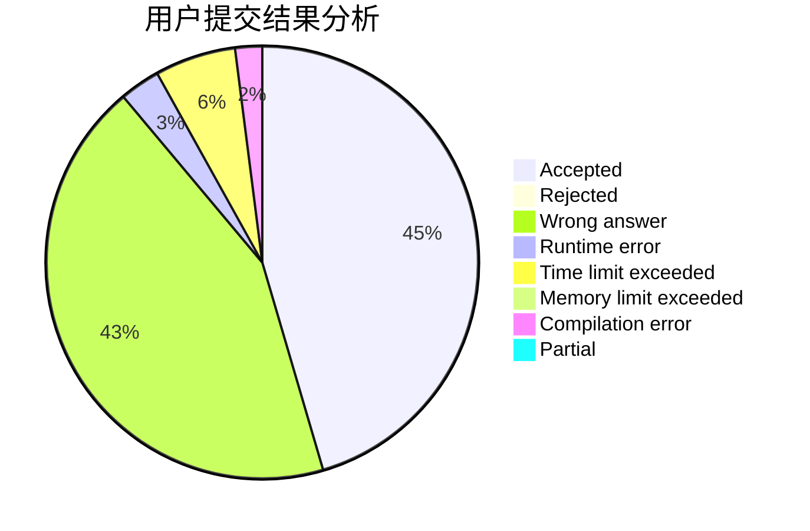
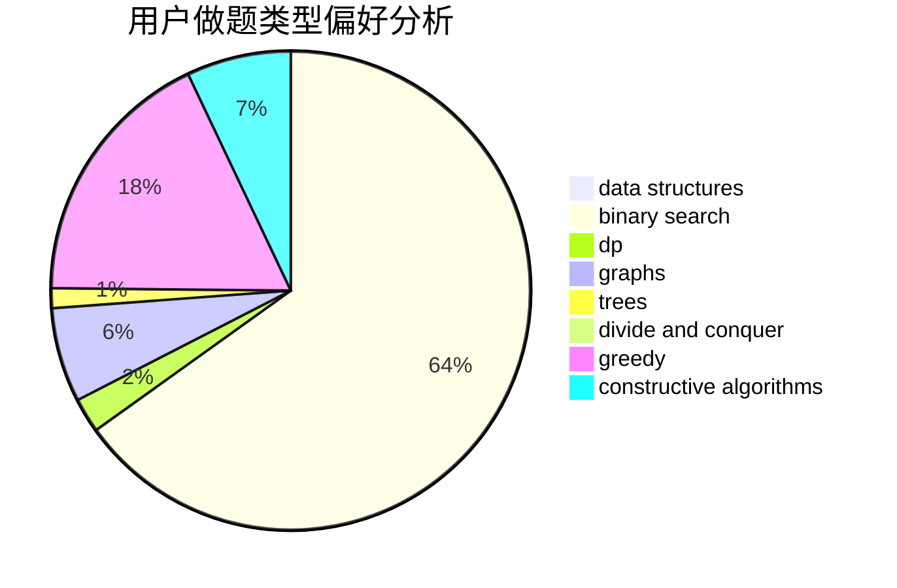
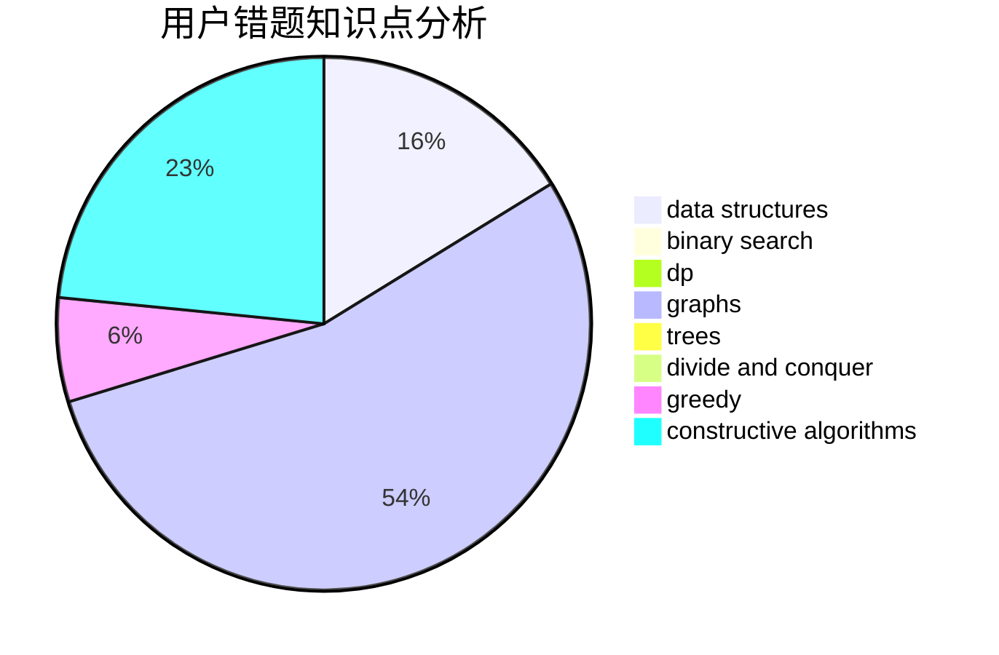

# hzt1

<!-- tabs:start -->

#### **用户提交结果分析**

#### **用户做题类型偏好分析**

#### **用户错题知识点分析**

<!-- tabs:end -->
# 推荐题目
[405B](https://codeforces.com/contest/405/problem/B)		nan		  
[3C](https://codeforces.com/contest/3/problem/C)		brute force,
                        games,
                        implementation		  
[1036B](https://codeforces.com/contest/1036/problem/B)		math		  
[884F](https://codeforces.com/contest/884/problem/F)		flows,
                        graphs,
                        greedy		  
[620C](https://codeforces.com/contest/620/problem/C)		greedy		  
[820A](https://codeforces.com/contest/820/problem/A)		implementation		  
[463D](https://codeforces.com/contest/463/problem/D)		dfs and similar,
                        dp,
                        graphs,
                        implementation		  
[1041B](https://codeforces.com/contest/1041/problem/B)		math		  
[1220F](https://codeforces.com/contest/1220/problem/F)		binary search,
                        data structures		  
[711D](https://codeforces.com/contest/711/problem/D)		combinatorics,
                        dfs and similar,
                        graphs,
                        math		  
