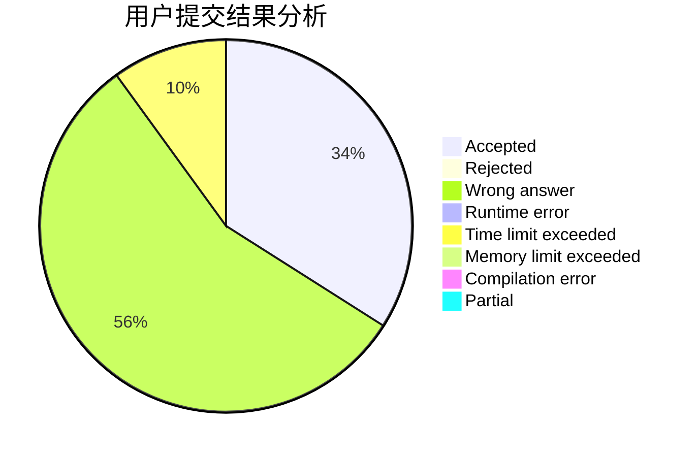
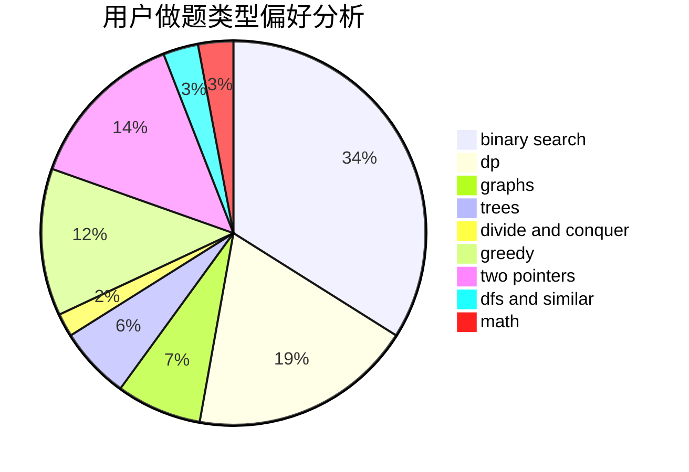

# iNx

<!-- tabs:start -->

#### **用户提交结果分析**

#### **用户做题类型偏好分析**

<!-- tabs:end -->
# 推荐题目
[1205F](https://codeforces.com/contest/1205/problem/F)
[575C](https://codeforces.com/contest/575/problem/C)
[671A](https://codeforces.com/contest/671/problem/A)
[1163E](https://codeforces.com/contest/1163/problem/E)
[696B](https://codeforces.com/contest/696/problem/B)
[703A](https://codeforces.com/contest/703/problem/A)
[1264C](https://codeforces.com/contest/1264/problem/C)
[678B](https://codeforces.com/contest/678/problem/B)
[79D](https://codeforces.com/contest/79/problem/D)
[367D](https://codeforces.com/contest/367/problem/D)
