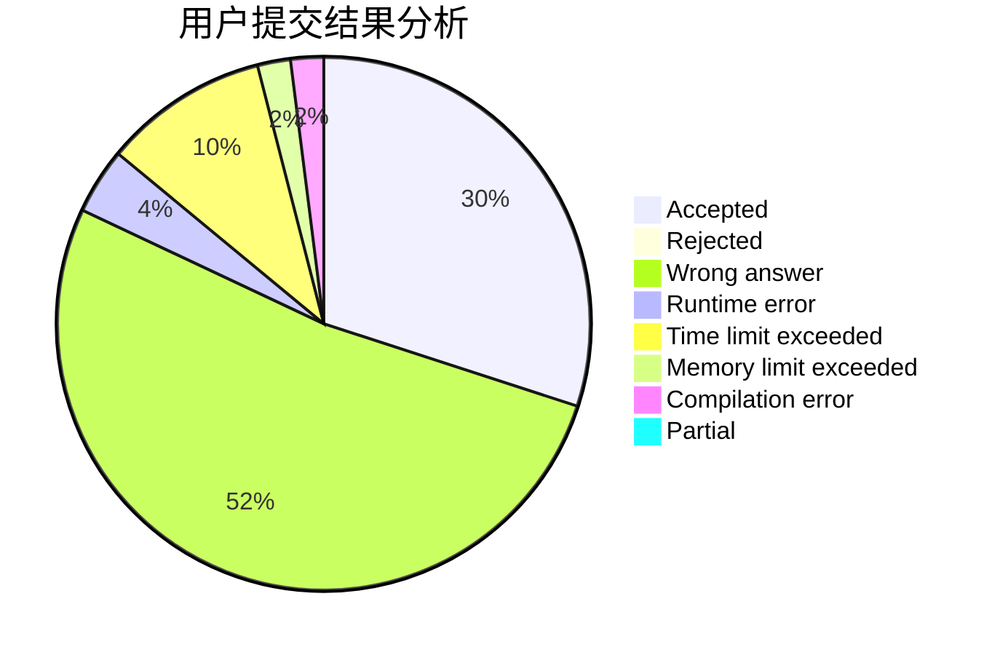
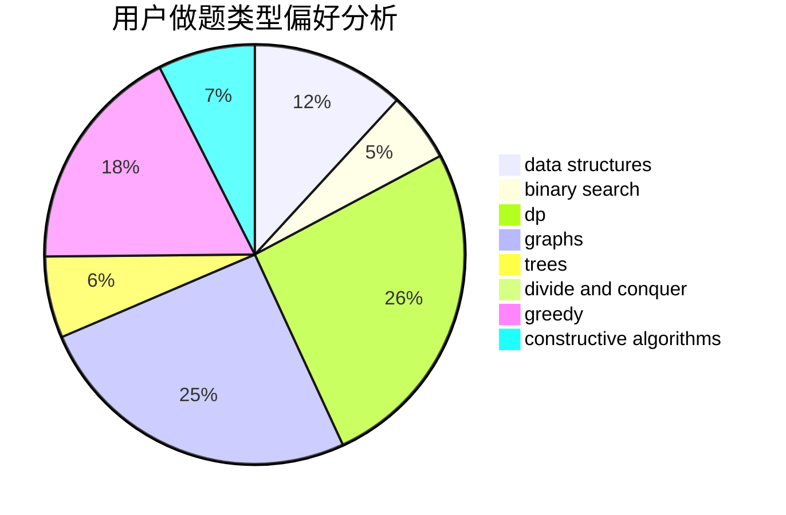
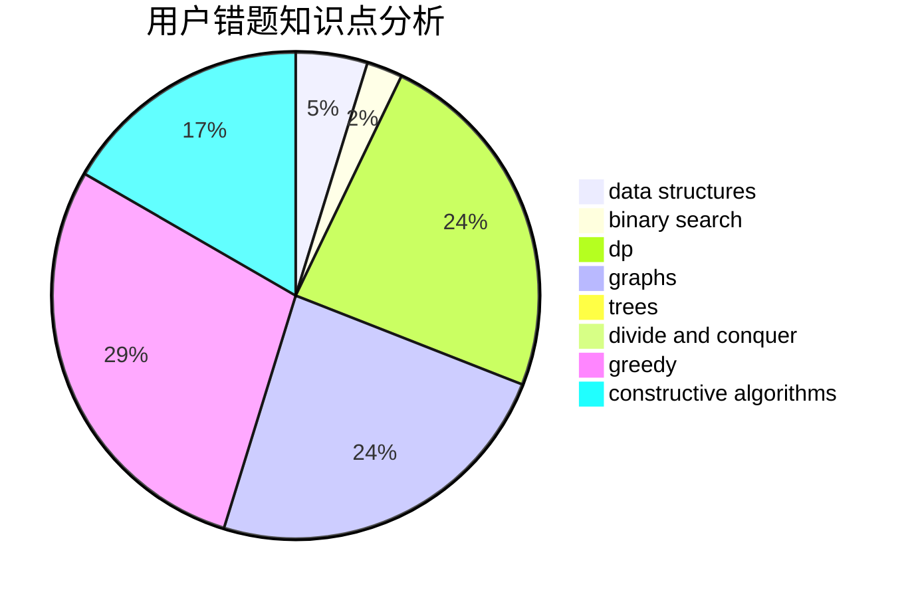

# i_m_a

<!-- tabs:start -->

#### **用户提交结果分析**

#### **用户做题类型偏好分析**

#### **用户错题知识点分析**

<!-- tabs:end -->
# 推荐题目
[1352B](https://codeforces.com/contest/1352/problem/B)		constructive algorithms,
                        math		  
[579A](https://codeforces.com/contest/579/problem/A)		bitmasks		  
[1353B](https://codeforces.com/contest/1353/problem/B)		greedy,
                        sortings		  
[495B](https://codeforces.com/contest/495/problem/B)		math,
                        number theory		  
[592A](https://codeforces.com/contest/592/problem/A)		implementation		  
[1213F](https://codeforces.com/contest/1213/problem/F)		data structures,
                        dfs and similar,
                        dsu,
                        graphs,
                        greedy,
                        implementation,
                        strings		  
[1070D](https://codeforces.com/contest/1070/problem/D)		greedy		  
[878D](https://codeforces.com/contest/878/problem/D)		bitmasks		  
[13681](https://codeforces.com/contest/1368/problem/1)		dsu,graphs,sortings,trees		  
[271D](https://codeforces.com/contest/271/problem/D)		data structures,
                        strings		  
