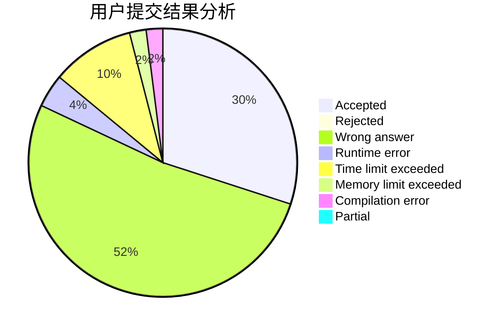
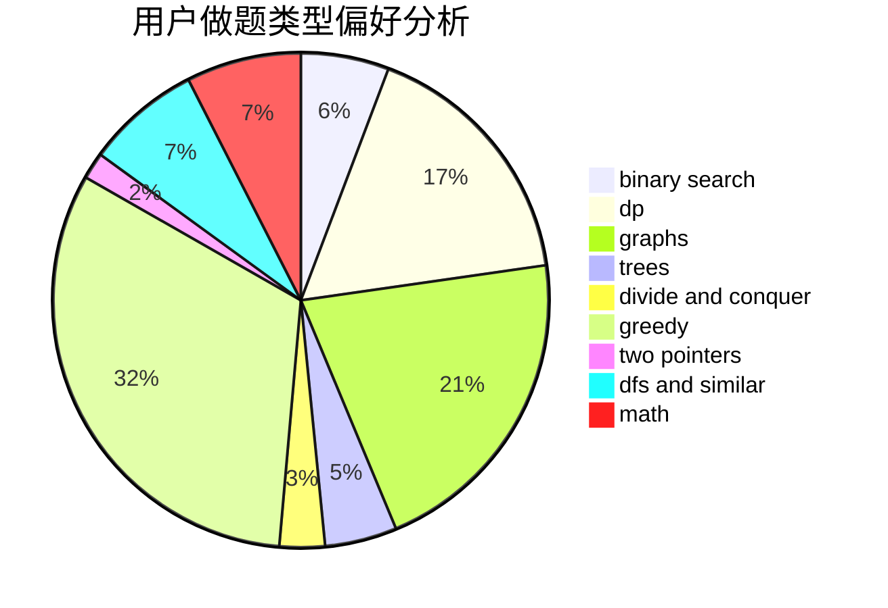

# i_m_a

<!-- tabs:start -->

#### **用户提交结果分析**

#### **用户做题类型偏好分析**

<!-- tabs:end -->
# 推荐题目
[1352B](https://codeforces.com/contest/1352/problem/B)
[579A](https://codeforces.com/contest/579/problem/A)
[1353B](https://codeforces.com/contest/1353/problem/B)
[495B](https://codeforces.com/contest/495/problem/B)
[592A](https://codeforces.com/contest/592/problem/A)
[1213F](https://codeforces.com/contest/1213/problem/F)
[1070D](https://codeforces.com/contest/1070/problem/D)
[878D](https://codeforces.com/contest/878/problem/D)
[13681](https://codeforces.com/contest/1368/problem/1)
[271D](https://codeforces.com/contest/271/problem/D)
