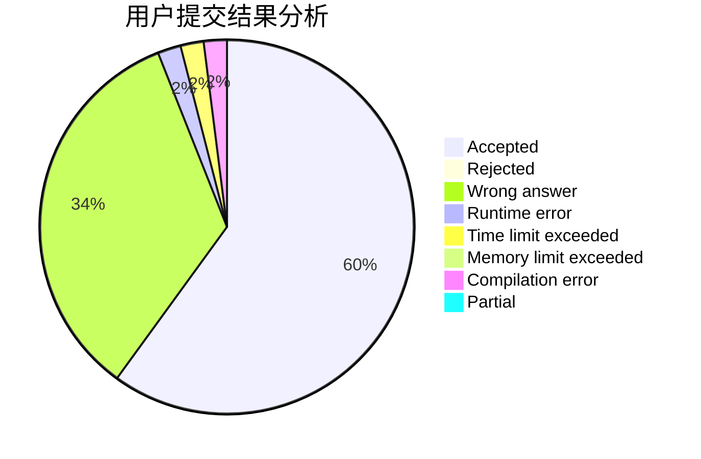
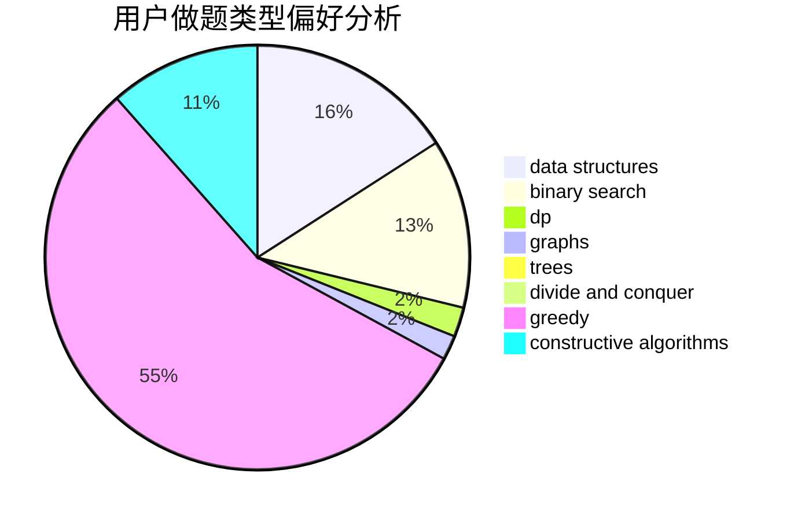

# iamgqr

<!-- tabs:start -->

#### **用户提交结果分析**

#### **用户做题类型偏好分析**

#### **用户错题知识点分析**

<!-- tabs:end -->
# 推荐题目
[702A](https://codeforces.com/contest/702/problem/A)		dp,
                        greedy,
                        implementation		  
[1442A](https://codeforces.com/contest/1442/problem/A)		constructive algorithms,
                        dp,
                        greedy		  
[1072D](https://codeforces.com/contest/1072/problem/D)		dsu,graphs,sortings,trees		  
[1454E](https://codeforces.com/contest/1454/problem/E)		combinatorics,
                        dfs and similar,
                        graphs,
                        trees		  
[1357E2](https://codeforces.com/contest/1357E/problem/2)		nan		  
[215B](https://codeforces.com/contest/215/problem/B)		greedy,
                        math		  
[1510I](https://codeforces.com/contest/1510/problem/I)		greedy,
                        interactive,
                        math,
                        probabilities		  
[1267K](https://codeforces.com/contest/1267/problem/K)		combinatorics,
                        math		  
[107C](https://codeforces.com/contest/107/problem/C)		bitmasks,
                        dp		  
[445A](https://codeforces.com/contest/445/problem/A)		dfs and similar,
                        implementation		  
