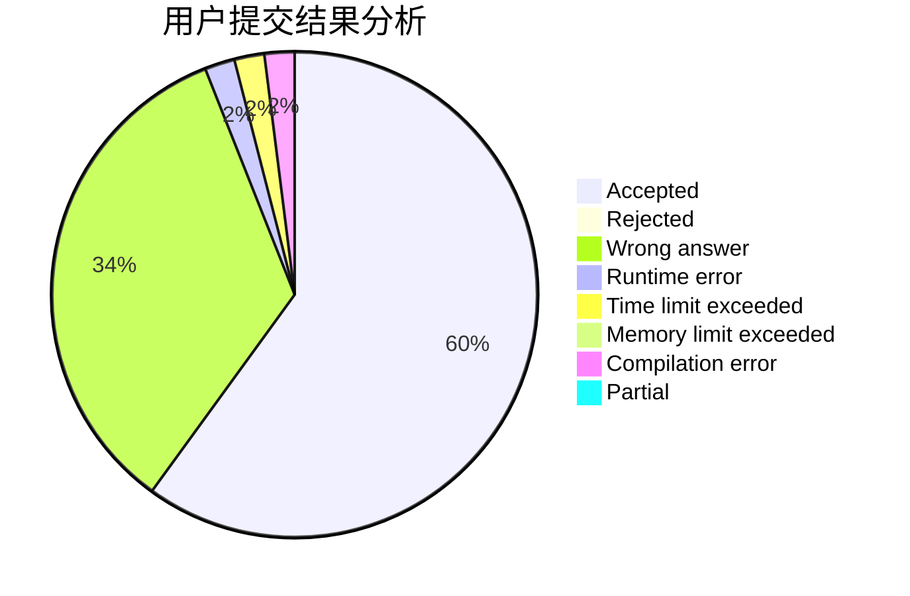
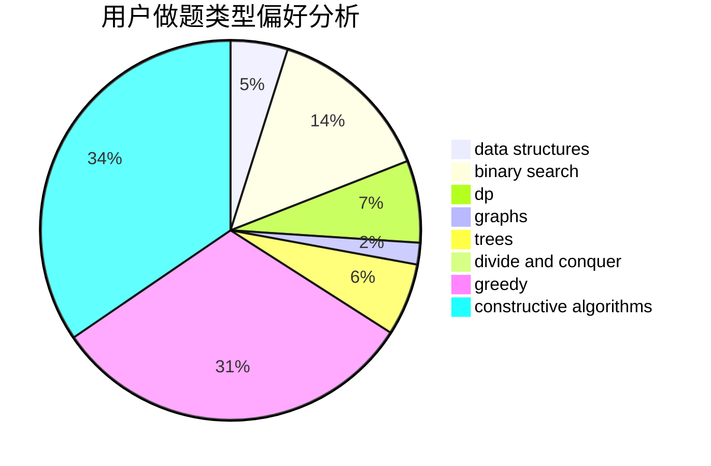

# iamgqr

<!-- tabs:start -->

#### **用户提交结果分析**

#### **用户做题类型偏好分析**

#### **用户错题知识点分析**

<!-- tabs:end -->
# 推荐题目
[720D](https://codeforces.com/contest/720/problem/D)		data structures,
                        dp,
                        sortings		  
[1451F](https://codeforces.com/contest/1451/problem/F)		constructive algorithms,
                        games		  
[1073C](https://codeforces.com/contest/1073/problem/C)		binary search,
                        two pointers		  
[1464B](https://codeforces.com/contest/1464/problem/B)		dsu,graphs,sortings,trees		  
[1366B](https://codeforces.com/contest/1366/problem/B)		math,
                        two pointers		  
[234A](https://codeforces.com/contest/234/problem/A)		implementation		  
[166A](https://codeforces.com/contest/166/problem/A)		binary search,
                        implementation,
                        sortings		  
[1276F](https://codeforces.com/contest/1276/problem/F)		string suffix structures		  
[1080B](https://codeforces.com/contest/1080/problem/B)		math		  
[464E](https://codeforces.com/contest/464/problem/E)		data structures,
                        graphs,
                        shortest paths		  
