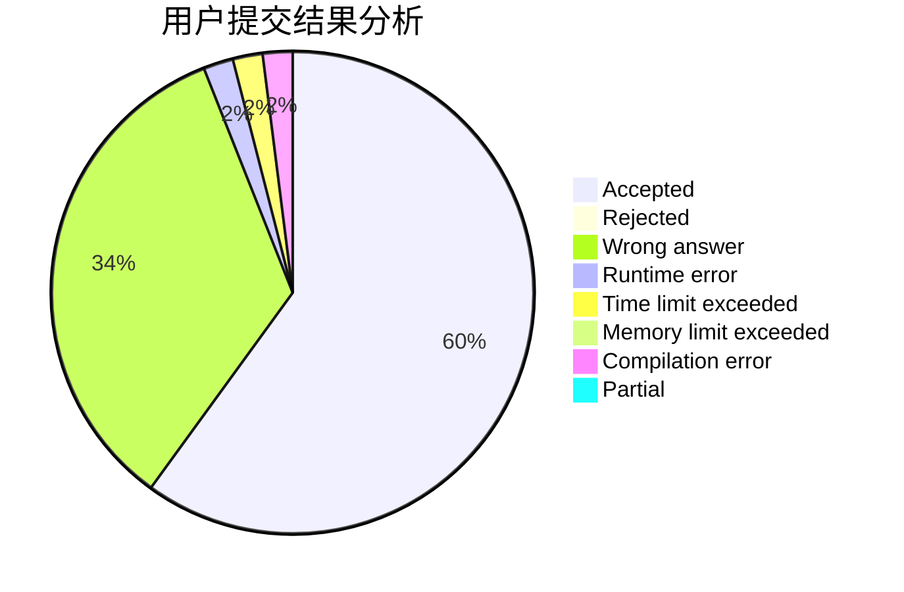
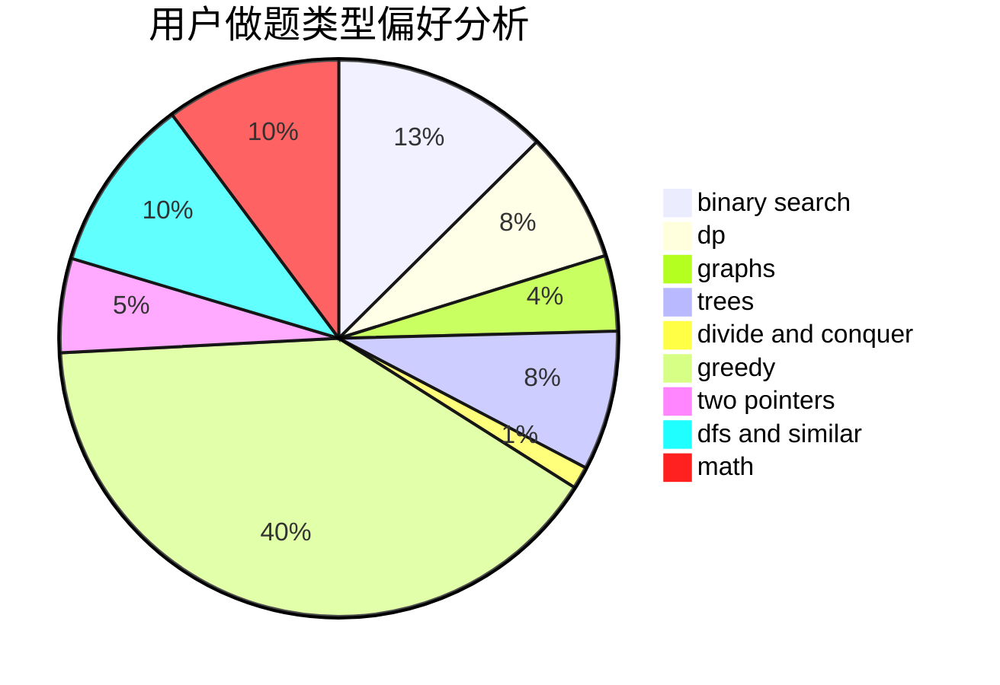

# iamgqr

<!-- tabs:start -->

#### **用户提交结果分析**

#### **用户做题类型偏好分析**

<!-- tabs:end -->
# 推荐题目
[720D](https://codeforces.com/contest/720/problem/D)
[1451F](https://codeforces.com/contest/1451/problem/F)
[1073C](https://codeforces.com/contest/1073/problem/C)
[1464B](https://codeforces.com/contest/1464/problem/B)
[1366B](https://codeforces.com/contest/1366/problem/B)
[234A](https://codeforces.com/contest/234/problem/A)
[166A](https://codeforces.com/contest/166/problem/A)
[1276F](https://codeforces.com/contest/1276/problem/F)
[1080B](https://codeforces.com/contest/1080/problem/B)
[464E](https://codeforces.com/contest/464/problem/E)
