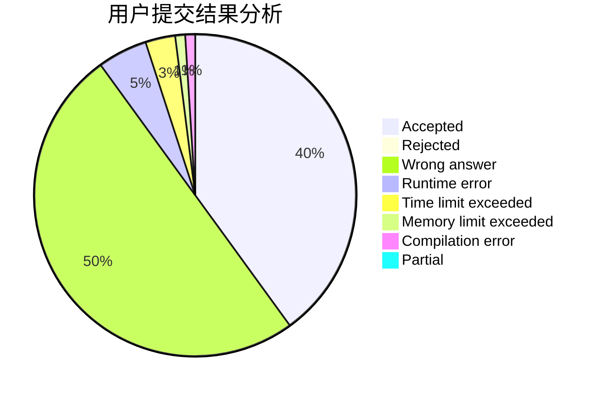
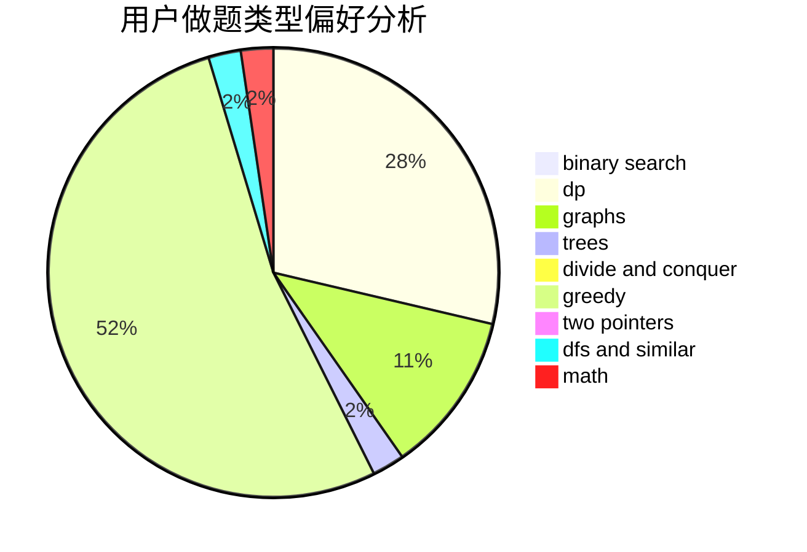

# iamhpp

<!-- tabs:start -->

#### **用户提交结果分析**

#### **用户做题类型偏好分析**

<!-- tabs:end -->
# 推荐题目
[1015D](https://codeforces.com/contest/1015/problem/D)
[926J](https://codeforces.com/contest/926/problem/J)
[891E](https://codeforces.com/contest/891/problem/E)
[372A](https://codeforces.com/contest/372/problem/A)
[1041E](https://codeforces.com/contest/1041/problem/E)
[811E](https://codeforces.com/contest/811/problem/E)
[446C](https://codeforces.com/contest/446/problem/C)
[1444B](https://codeforces.com/contest/1444/problem/B)
[1099A](https://codeforces.com/contest/1099/problem/A)
[1198D](https://codeforces.com/contest/1198/problem/D)
