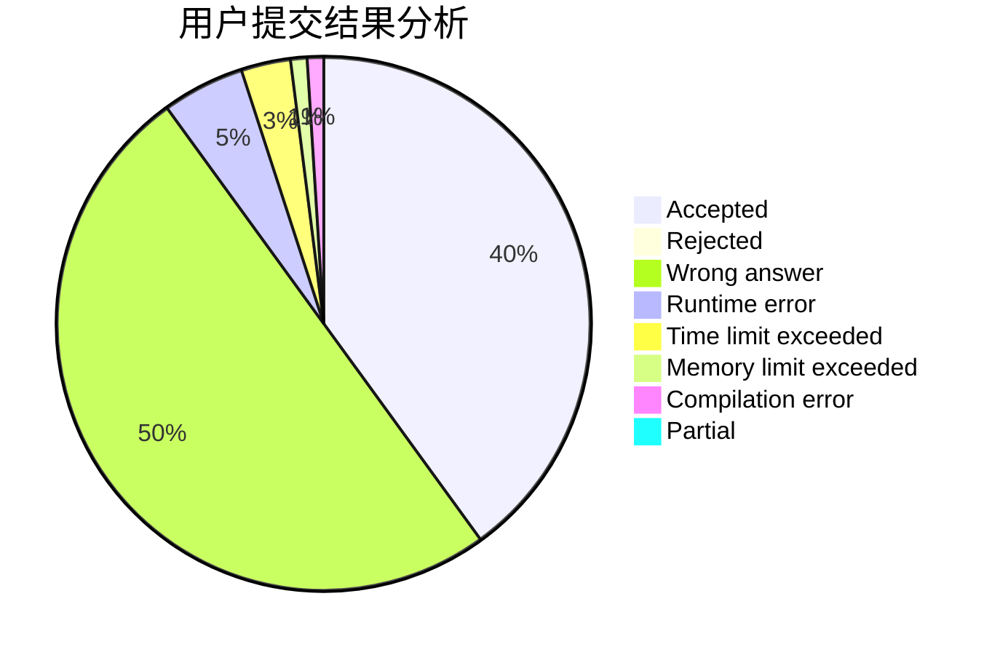
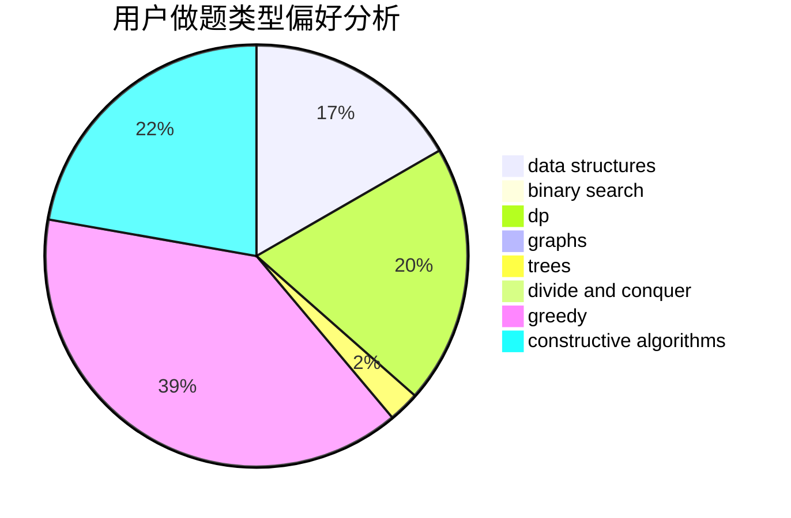
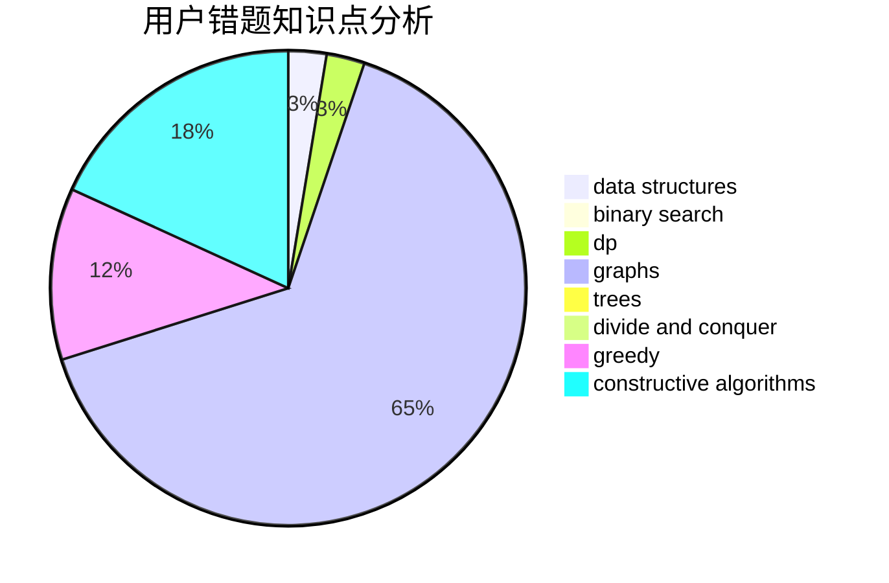

# iamhpp

<!-- tabs:start -->

#### **用户提交结果分析**

#### **用户做题类型偏好分析**

#### **用户错题知识点分析**

<!-- tabs:end -->
# 推荐题目
[1015D](https://codeforces.com/contest/1015/problem/D)		constructive algorithms,
                        greedy		  
[926J](https://codeforces.com/contest/926/problem/J)		data structures		  
[891E](https://codeforces.com/contest/891/problem/E)		combinatorics,
                        math,
                        matrices		  
[372A](https://codeforces.com/contest/372/problem/A)		binary search,
                        greedy,
                        sortings,
                        two pointers		  
[1041E](https://codeforces.com/contest/1041/problem/E)		constructive algorithms,
                        data structures,
                        graphs,
                        greedy		  
[811E](https://codeforces.com/contest/811/problem/E)		data structures,
                        dsu,
                        graphs		  
[446C](https://codeforces.com/contest/446/problem/C)		data structures,
                        math,
                        number theory		  
[1444B](https://codeforces.com/contest/1444/problem/B)		combinatorics,
                        math,
                        sortings		  
[1099A](https://codeforces.com/contest/1099/problem/A)		implementation		  
[1198D](https://codeforces.com/contest/1198/problem/D)		dp		  
