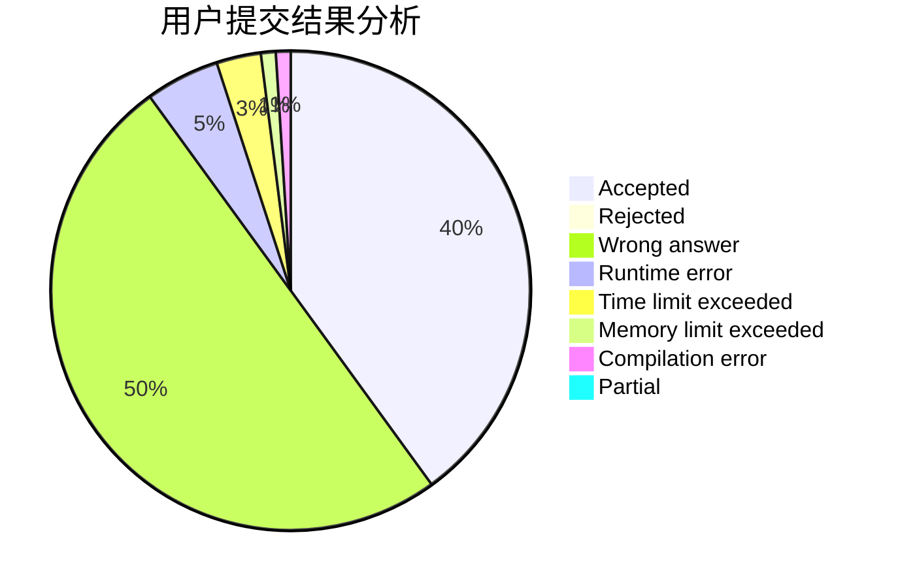
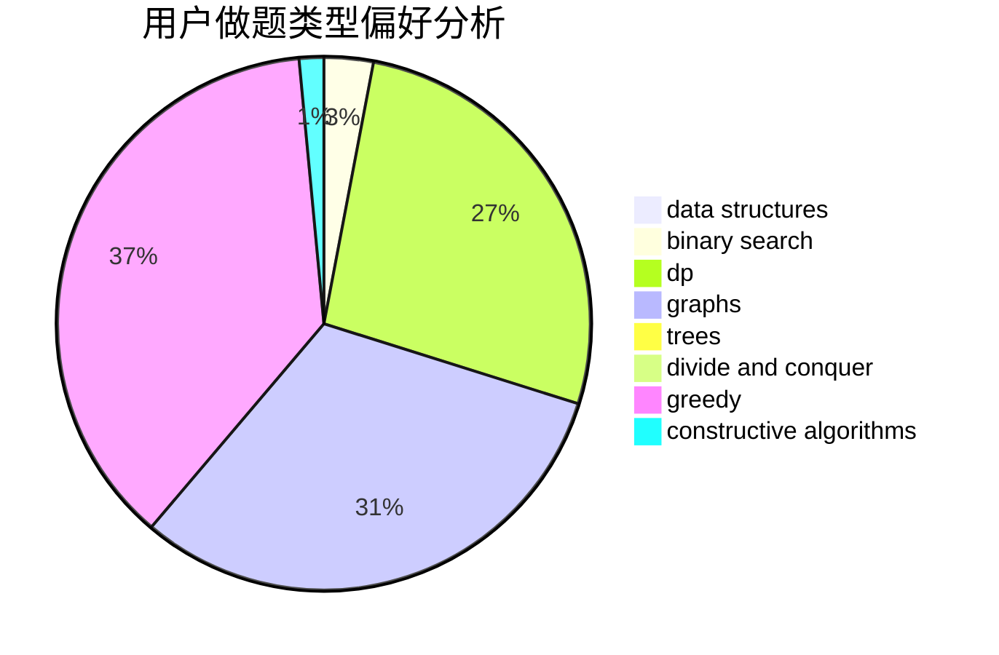
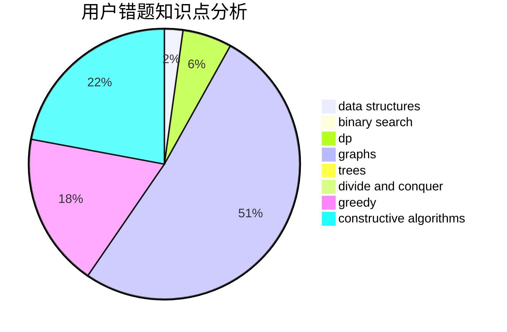

# iamhpp

<!-- tabs:start -->

#### **用户提交结果分析**

#### **用户做题类型偏好分析**

#### **用户错题知识点分析**

<!-- tabs:end -->
# 推荐题目
[1015C](https://codeforces.com/contest/1015/problem/C)		sortings		  
[911B](https://codeforces.com/contest/911/problem/B)		binary search,
                        brute force,
                        implementation		  
[871A](https://codeforces.com/contest/871/problem/A)		dsu,graphs,sortings,trees		  
[346D](https://codeforces.com/contest/346/problem/D)		dp,
                        graphs,
                        shortest paths		  
[1041B](https://codeforces.com/contest/1041/problem/B)		math		  
[797F](https://codeforces.com/contest/797/problem/F)		data structures,
                        dp,
                        greedy,
                        sortings		  
[421A](https://codeforces.com/contest/421/problem/A)		constructive algorithms,
                        implementation		  
[1434B](https://codeforces.com/contest/1434/problem/B)		dsu,graphs,sortings,trees		  
[1098D](https://codeforces.com/contest/1098/problem/D)		data structures		  
[1194B](https://codeforces.com/contest/1194/problem/B)		implementation		  
