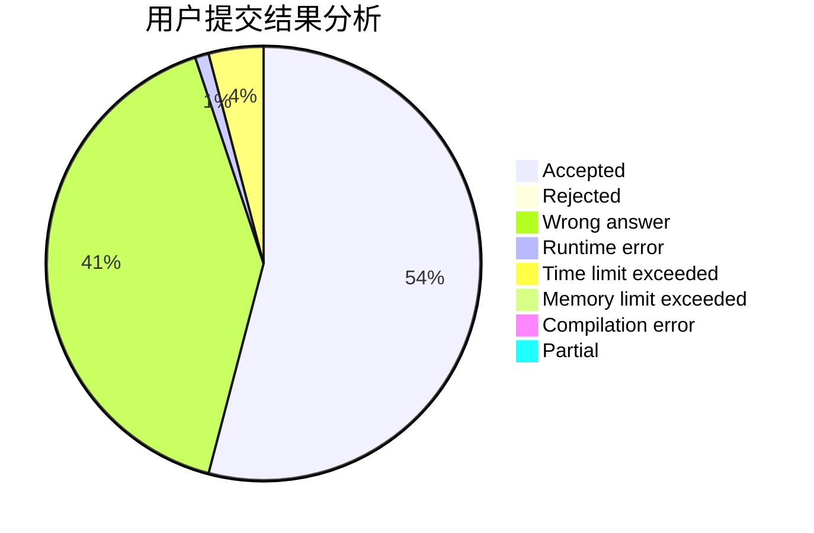
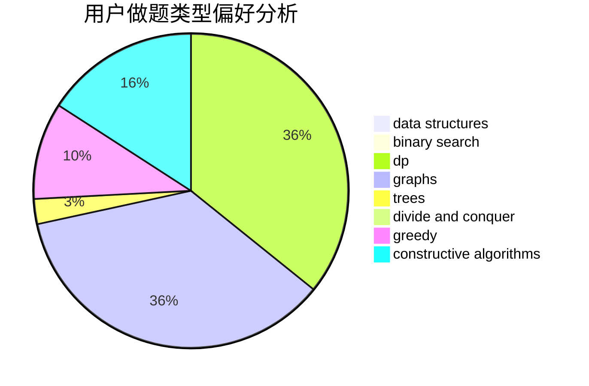

# ianahao

<!-- tabs:start -->

#### **用户提交结果分析**

#### **用户做题类型偏好分析**

#### **用户错题知识点分析**

<!-- tabs:end -->
# 推荐题目
[1431D](https://codeforces.com/contest/1431/problem/D)		*special problem,
                        greedy		  
[788B](https://codeforces.com/contest/788/problem/B)		combinatorics,
                        constructive algorithms,
                        dfs and similar,
                        dsu,
                        graphs		  
[702B](https://codeforces.com/contest/702/problem/B)		brute force,
                        data structures,
                        implementation,
                        math		  
[295E](https://codeforces.com/contest/295/problem/E)		data structures		  
[1423J](https://codeforces.com/contest/1423/problem/J)		bitmasks,
                        constructive algorithms,
                        dp,
                        math		  
[1295E](https://codeforces.com/contest/1295/problem/E)		data structures,
                        divide and conquer		  
[698F](https://codeforces.com/contest/698/problem/F)		combinatorics,
                        number theory		  
[1003C](https://codeforces.com/contest/1003/problem/C)		brute force,
                        implementation,
                        math		  
[1111E](https://codeforces.com/contest/1111/problem/E)		data structures,
                        dfs and similar,
                        dp,
                        graphs,
                        trees		  
[10152](https://codeforces.com/contest/1015/problem/2)		dsu,graphs,sortings,trees		  
