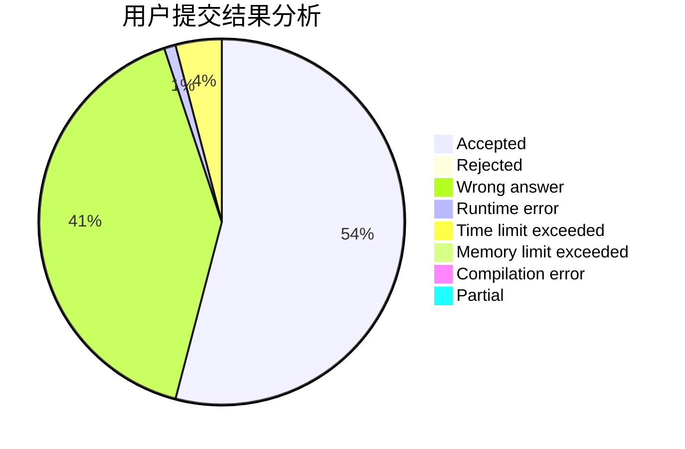
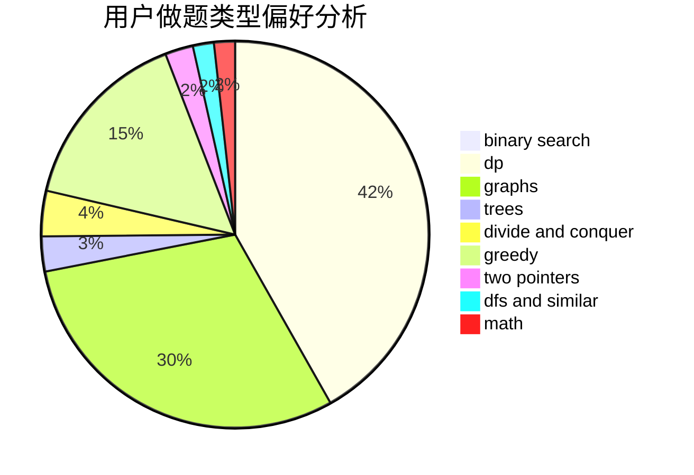

# ianahao

<!-- tabs:start -->

#### **用户提交结果分析**

#### **用户做题类型偏好分析**

<!-- tabs:end -->
# 推荐题目
[1431D](https://codeforces.com/contest/1431/problem/D)
[788B](https://codeforces.com/contest/788/problem/B)
[702B](https://codeforces.com/contest/702/problem/B)
[295E](https://codeforces.com/contest/295/problem/E)
[1423J](https://codeforces.com/contest/1423/problem/J)
[1295E](https://codeforces.com/contest/1295/problem/E)
[698F](https://codeforces.com/contest/698/problem/F)
[1003C](https://codeforces.com/contest/1003/problem/C)
[1111E](https://codeforces.com/contest/1111/problem/E)
[10152](https://codeforces.com/contest/1015/problem/2)
