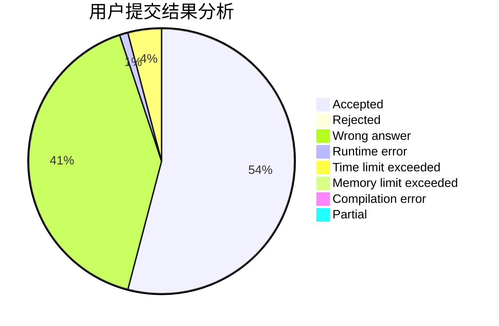
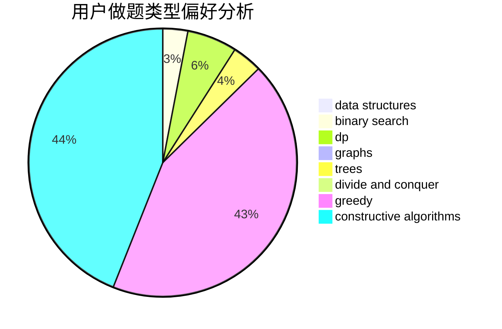

# ianahao

<!-- tabs:start -->

#### **用户提交结果分析**

#### **用户做题类型偏好分析**

#### **用户错题知识点分析**

<!-- tabs:end -->
# 推荐题目
[1423I](https://codeforces.com/contest/1423/problem/I)		bitmasks		  
[768C](https://codeforces.com/contest/768/problem/C)		brute force,
                        dp,
                        implementation,
                        sortings		  
[678D](https://codeforces.com/contest/678/problem/D)		math,
                        number theory		  
[280A](https://codeforces.com/contest/280/problem/A)		geometry		  
[1415F](https://codeforces.com/contest/1415/problem/F)		dp		  
[1288C](https://codeforces.com/contest/1288/problem/C)		combinatorics,
                        dp		  
[672D](https://codeforces.com/contest/672/problem/D)		dsu,graphs,sortings,trees		  
[1002E2](https://codeforces.com/contest/1002E/problem/2)		nan		  
[1111A](https://codeforces.com/contest/1111/problem/A)		implementation,
                        strings		  
[1013D](https://codeforces.com/contest/1013/problem/D)		dsu,graphs,sortings,trees		  
