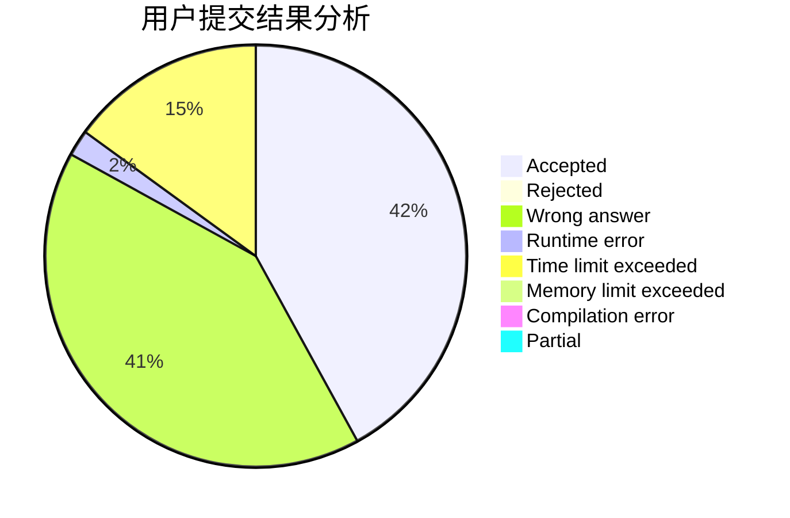
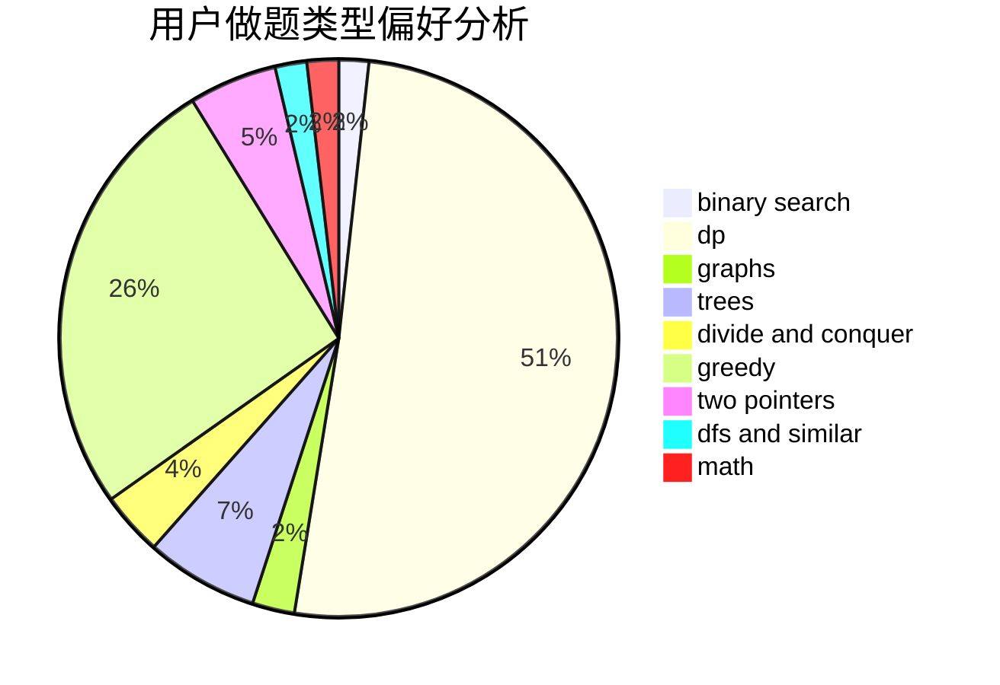

# icemage

<!-- tabs:start -->

#### **用户提交结果分析**

#### **用户做题类型偏好分析**

<!-- tabs:end -->
# 推荐题目
[449C](https://codeforces.com/contest/449/problem/C)
[229D](https://codeforces.com/contest/229/problem/D)
[145C](https://codeforces.com/contest/145/problem/C)
[5132](https://codeforces.com/contest/513/problem/2)
[1008C](https://codeforces.com/contest/1008/problem/C)
[992D](https://codeforces.com/contest/992/problem/D)
[793F](https://codeforces.com/contest/793/problem/F)
[755D](https://codeforces.com/contest/755/problem/D)
[461E](https://codeforces.com/contest/461/problem/E)
[1337E](https://codeforces.com/contest/1337/problem/E)
