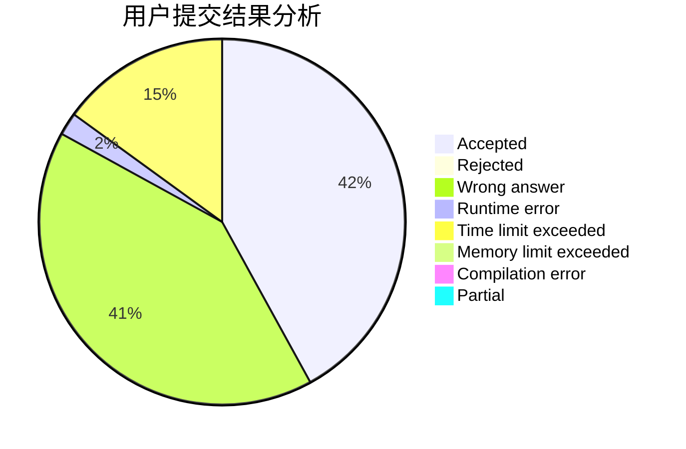
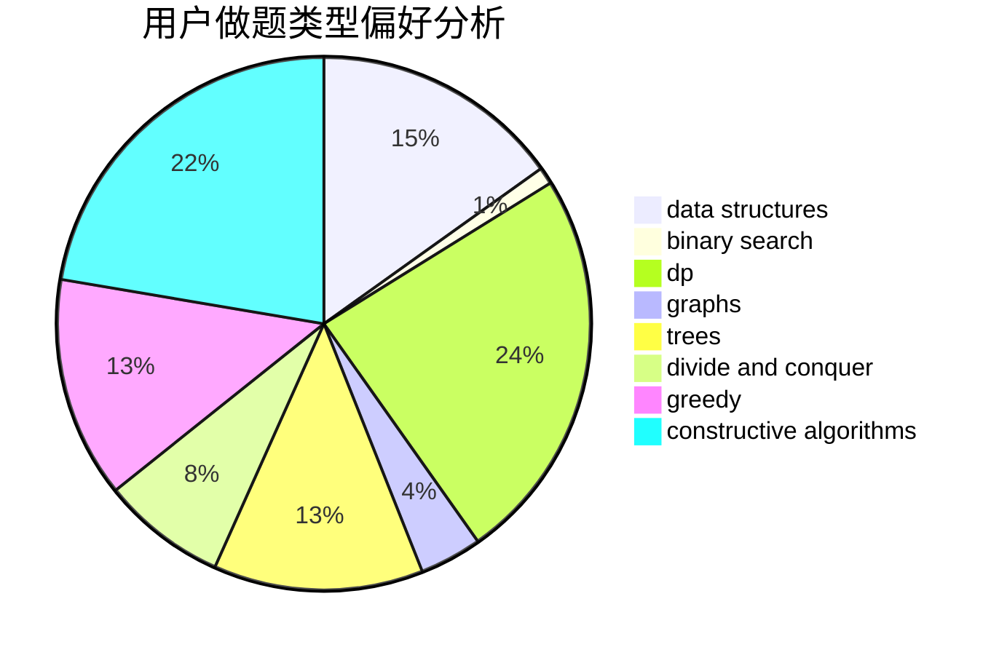

# icemage

<!-- tabs:start -->

#### **用户提交结果分析**

#### **用户做题类型偏好分析**

#### **用户错题知识点分析**

<!-- tabs:end -->
# 推荐题目
[449C](https://codeforces.com/contest/449/problem/C)		constructive algorithms,
                        number theory		  
[229D](https://codeforces.com/contest/229/problem/D)		dp,
                        greedy,
                        two pointers		  
[145C](https://codeforces.com/contest/145/problem/C)		combinatorics,
                        dp,
                        math		  
[5132](https://codeforces.com/contest/513/problem/2)		dsu,graphs,sortings,trees		  
[1008C](https://codeforces.com/contest/1008/problem/C)		dsu,graphs,sortings,trees		  
[992D](https://codeforces.com/contest/992/problem/D)		brute force,
                        implementation,
                        math		  
[793F](https://codeforces.com/contest/793/problem/F)		data structures,
                        divide and conquer,
                        dp		  
[755D](https://codeforces.com/contest/755/problem/D)		data structures		  
[461E](https://codeforces.com/contest/461/problem/E)		binary search,
                        shortest paths,
                        strings		  
[1337E](https://codeforces.com/contest/1337/problem/E)		dsu,graphs,sortings,trees		  
