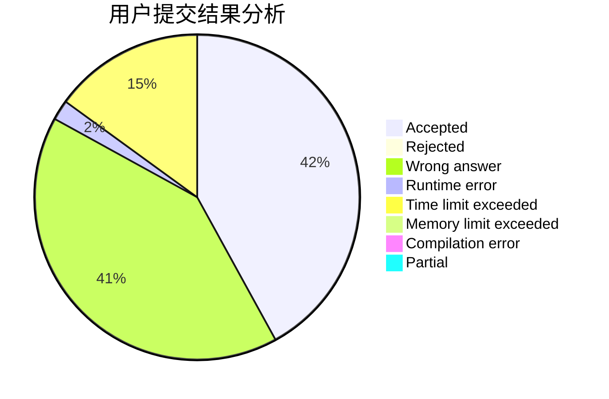
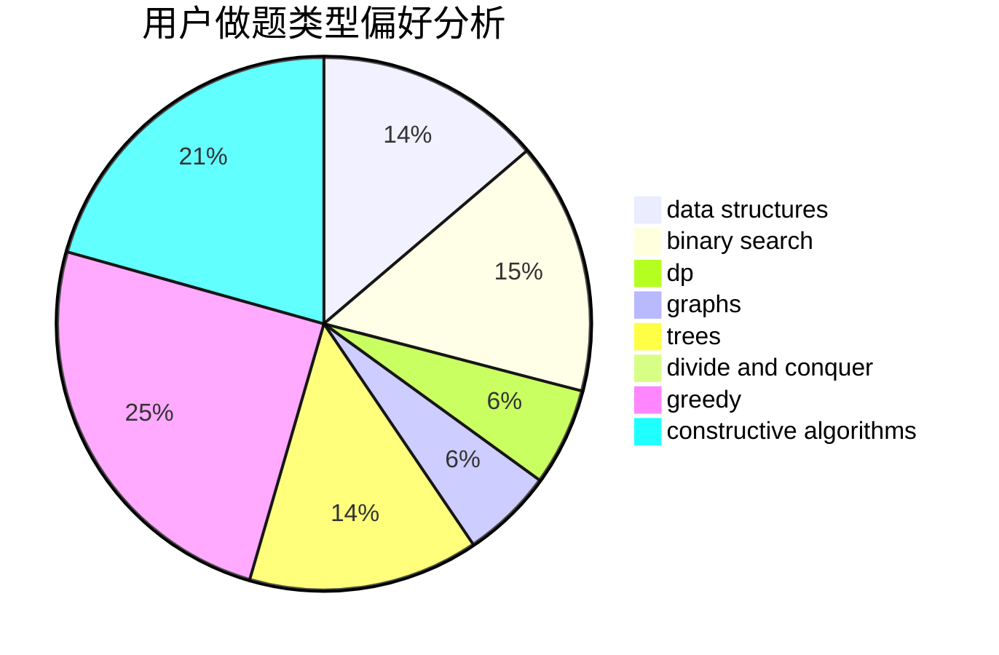

# icemage

<!-- tabs:start -->

#### **用户提交结果分析**

#### **用户做题类型偏好分析**

#### **用户错题知识点分析**

<!-- tabs:end -->
# 推荐题目
[425E](https://codeforces.com/contest/425/problem/E)		dp		  
[205B](https://codeforces.com/contest/205/problem/B)		brute force,
                        greedy		  
[1451C](https://codeforces.com/contest/1451/problem/C)		dp,
                        greedy,
                        hashing,
                        implementation,
                        strings		  
[492E](https://codeforces.com/contest/492/problem/E)		math		  
[1007E](https://codeforces.com/contest/1007/problem/E)		dp		  
[978F](https://codeforces.com/contest/978/problem/F)		binary search,
                        data structures,
                        implementation		  
[774G](https://codeforces.com/contest/774/problem/G)		*special problem,
                        number theory		  
[734E](https://codeforces.com/contest/734/problem/E)		dfs and similar,
                        dp,
                        trees		  
[43E](https://codeforces.com/contest/43/problem/E)		brute force,
                        implementation,
                        two pointers		  
[1331F](https://codeforces.com/contest/1331/problem/F)		brute force,
                        dp,
                        strings		  
