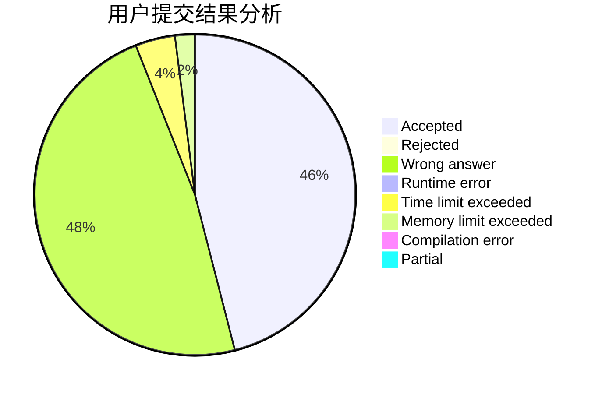
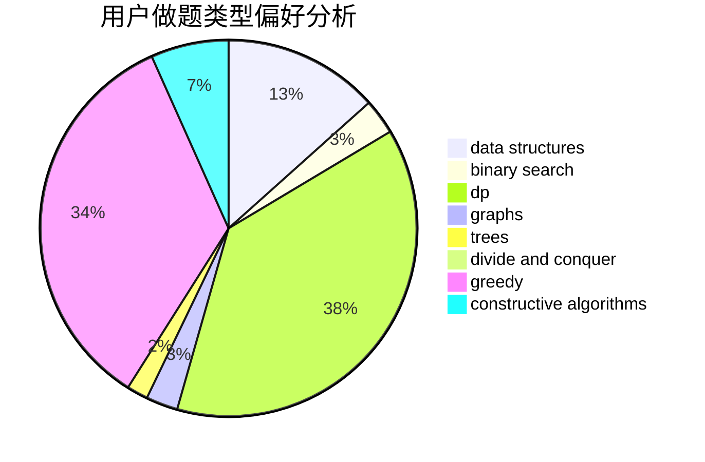
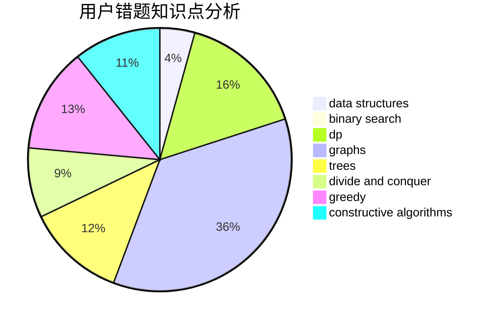

# iceyisdashing

<!-- tabs:start -->

#### **用户提交结果分析**

#### **用户做题类型偏好分析**

#### **用户错题知识点分析**

<!-- tabs:end -->
# 推荐题目
[1500E](https://codeforces.com/contest/1500/problem/E)		binary search,
                        data structures		  
[896A](https://codeforces.com/contest/896/problem/A)		binary search,
                        dfs and similar		  
[198B](https://codeforces.com/contest/198/problem/B)		shortest paths		  
[681B](https://codeforces.com/contest/681/problem/B)		brute force		  
[166E](https://codeforces.com/contest/166/problem/E)		dp,
                        math,
                        matrices		  
[208D](https://codeforces.com/contest/208/problem/D)		implementation		  
[33D](https://codeforces.com/contest/33/problem/D)		geometry,
                        graphs,
                        shortest paths,
                        sortings		  
[1238E](https://codeforces.com/contest/1238/problem/E)		bitmasks,
                        dp		  
[1278B](https://codeforces.com/contest/1278/problem/B)		greedy,
                        math		  
[1281F](https://codeforces.com/contest/1281/problem/F)		dsu,graphs,sortings,trees		  
