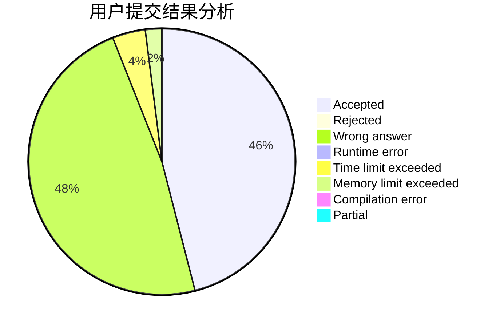
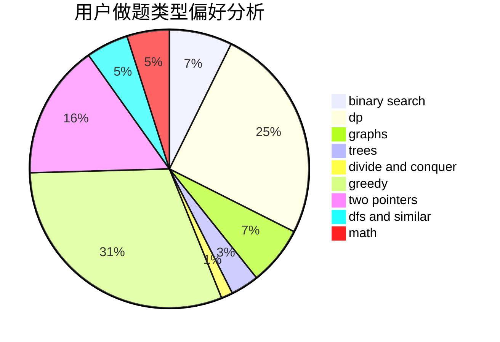

# iceyisdashing

<!-- tabs:start -->

#### **用户提交结果分析**

#### **用户做题类型偏好分析**

<!-- tabs:end -->
# 推荐题目
[1500E](https://codeforces.com/contest/1500/problem/E)
[896A](https://codeforces.com/contest/896/problem/A)
[198B](https://codeforces.com/contest/198/problem/B)
[681B](https://codeforces.com/contest/681/problem/B)
[166E](https://codeforces.com/contest/166/problem/E)
[208D](https://codeforces.com/contest/208/problem/D)
[33D](https://codeforces.com/contest/33/problem/D)
[1238E](https://codeforces.com/contest/1238/problem/E)
[1278B](https://codeforces.com/contest/1278/problem/B)
[1281F](https://codeforces.com/contest/1281/problem/F)
