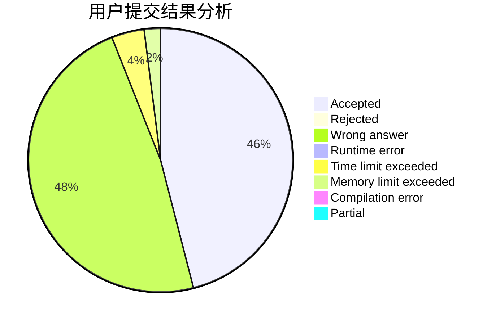
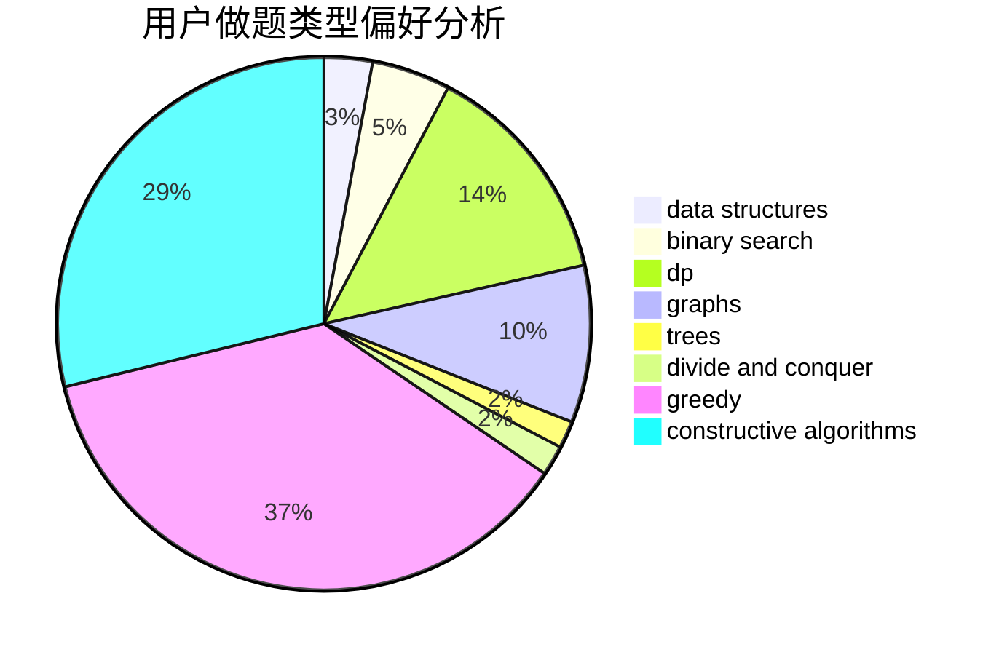
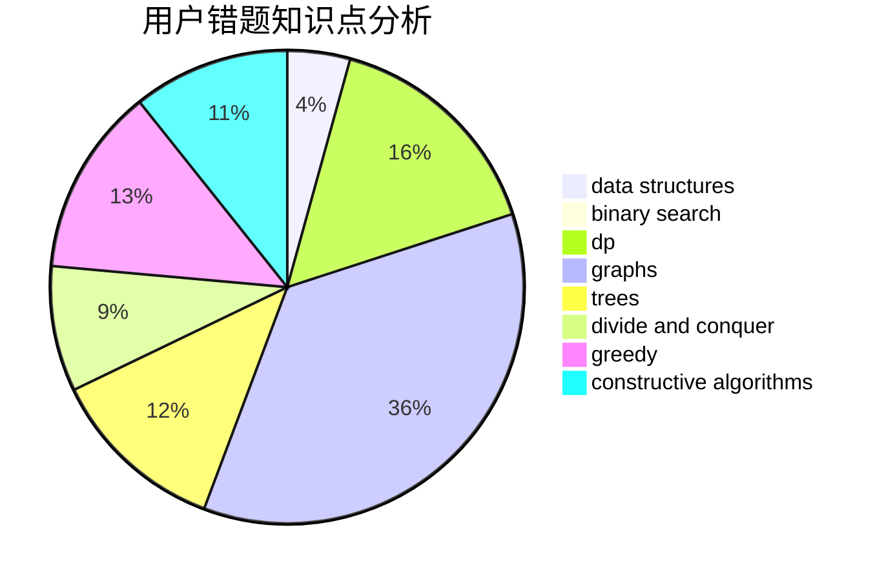

# iceyisdashing

<!-- tabs:start -->

#### **用户提交结果分析**

#### **用户做题类型偏好分析**

#### **用户错题知识点分析**

<!-- tabs:end -->
# 推荐题目
[1492D](https://codeforces.com/contest/1492/problem/D)		bitmasks,
                        constructive algorithms,
                        greedy,
                        math		  
[875F](https://codeforces.com/contest/875/problem/F)		dsu,
                        graphs,
                        greedy		  
[171B](https://codeforces.com/contest/171/problem/B)		*special problem,
                        combinatorics		  
[660D](https://codeforces.com/contest/660/problem/D)		geometry		  
[1510K](https://codeforces.com/contest/1510/problem/K)		brute force,
                        graphs,
                        implementation		  
[181B](https://codeforces.com/contest/181/problem/B)		binary search,
                        brute force		  
[316B2](https://codeforces.com/contest/316B/problem/2)		dfs and similar,
                        dp		  
[1230A](https://codeforces.com/contest/1230/problem/A)		brute force,
                        implementation		  
[1269B](https://codeforces.com/contest/1269/problem/B)		brute force,
                        sortings		  
[1272D](https://codeforces.com/contest/1272/problem/D)		brute force,
                        dp		  
