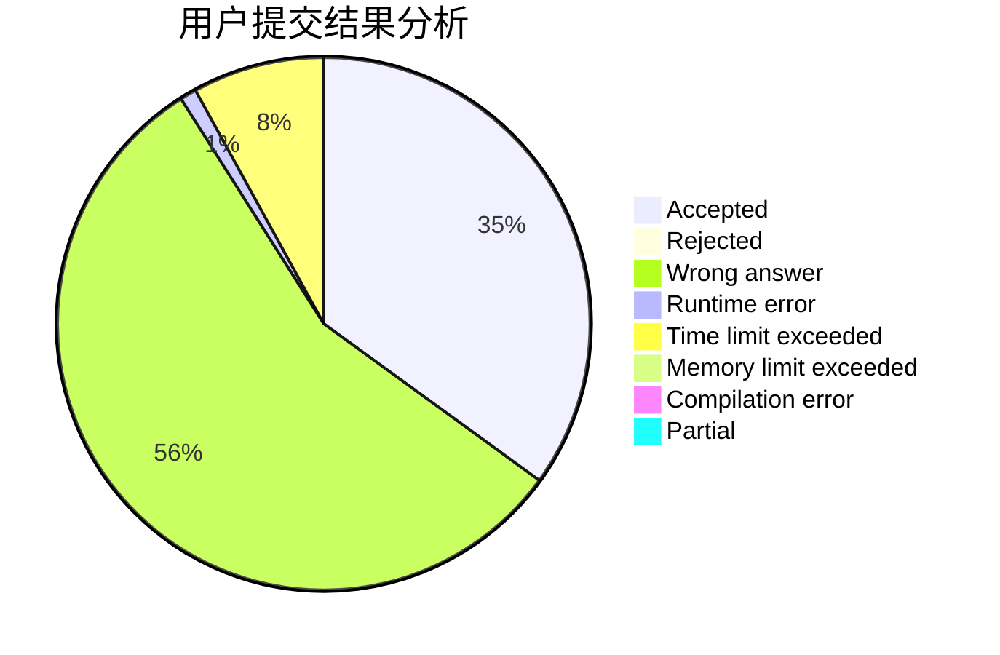
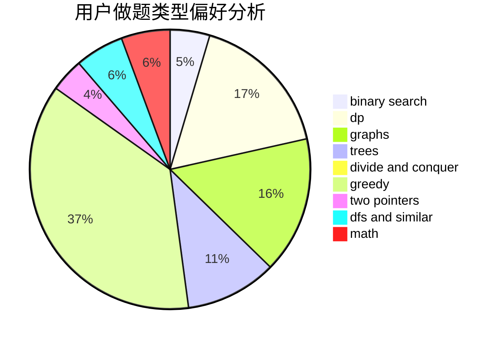

# iceyishandsome

<!-- tabs:start -->

#### **用户提交结果分析**

#### **用户做题类型偏好分析**

<!-- tabs:end -->
# 推荐题目
[1117D](https://codeforces.com/contest/1117/problem/D)
[899D](https://codeforces.com/contest/899/problem/D)
[515E](https://codeforces.com/contest/515/problem/E)
[577A](https://codeforces.com/contest/577/problem/A)
[277D](https://codeforces.com/contest/277/problem/D)
[1145F](https://codeforces.com/contest/1145/problem/F)
[936B](https://codeforces.com/contest/936/problem/B)
[652D](https://codeforces.com/contest/652/problem/D)
[847K](https://codeforces.com/contest/847/problem/K)
[666D](https://codeforces.com/contest/666/problem/D)
