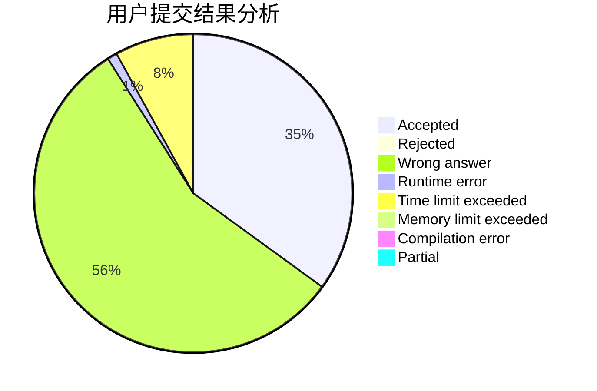
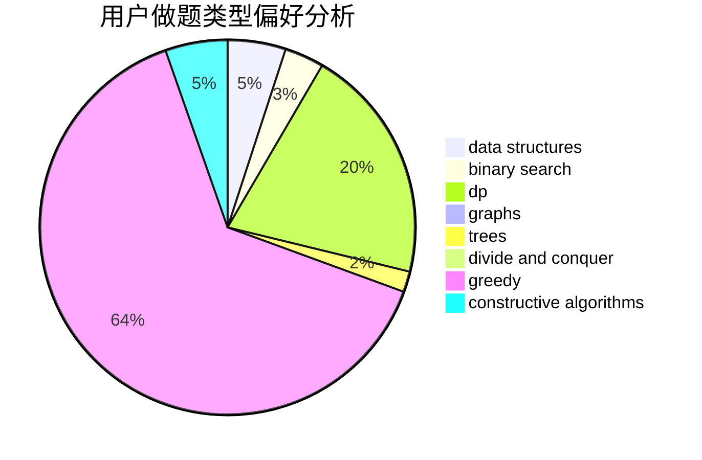
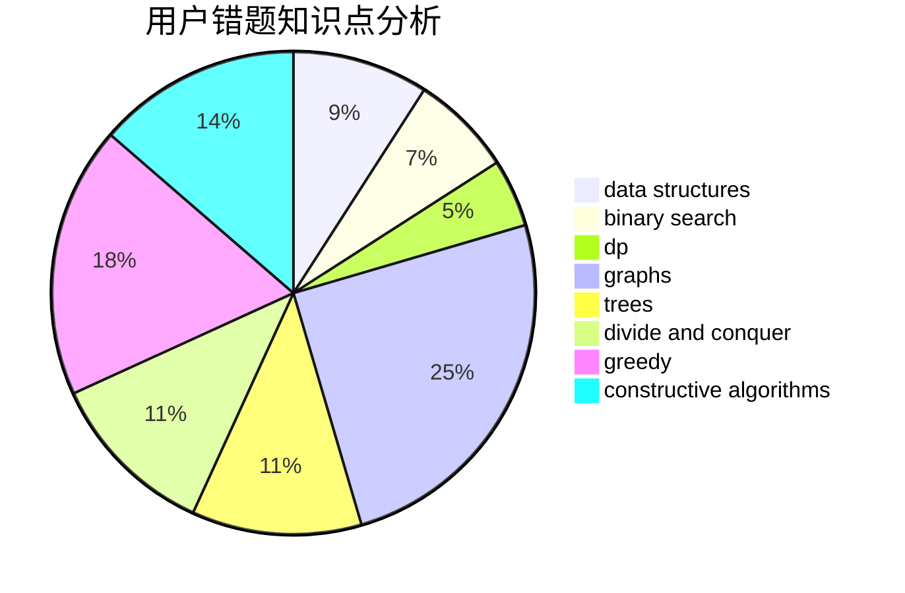

# iceyishandsome

<!-- tabs:start -->

#### **用户提交结果分析**

#### **用户做题类型偏好分析**

#### **用户错题知识点分析**

<!-- tabs:end -->
# 推荐题目
[1116A2](https://codeforces.com/contest/1116A/problem/2)		nan		  
[878E](https://codeforces.com/contest/878/problem/E)		combinatorics,
                        dp		  
[496B](https://codeforces.com/contest/496/problem/B)		brute force,
                        constructive algorithms,
                        implementation		  
[551E](https://codeforces.com/contest/551/problem/E)		binary search,
                        data structures,
                        implementation		  
[25D](https://codeforces.com/contest/25/problem/D)		dsu,
                        graphs,
                        trees		  
[1143E](https://codeforces.com/contest/1143/problem/E)		dsu,graphs,sortings,trees		  
[916B](https://codeforces.com/contest/916/problem/B)		bitmasks,
                        greedy,
                        math		  
[625E](https://codeforces.com/contest/625/problem/E)		data structures,
                        greedy		  
[82D](https://codeforces.com/contest/82/problem/D)		dp		  
[634A](https://codeforces.com/contest/634/problem/A)		constructive algorithms,
                        implementation		  
