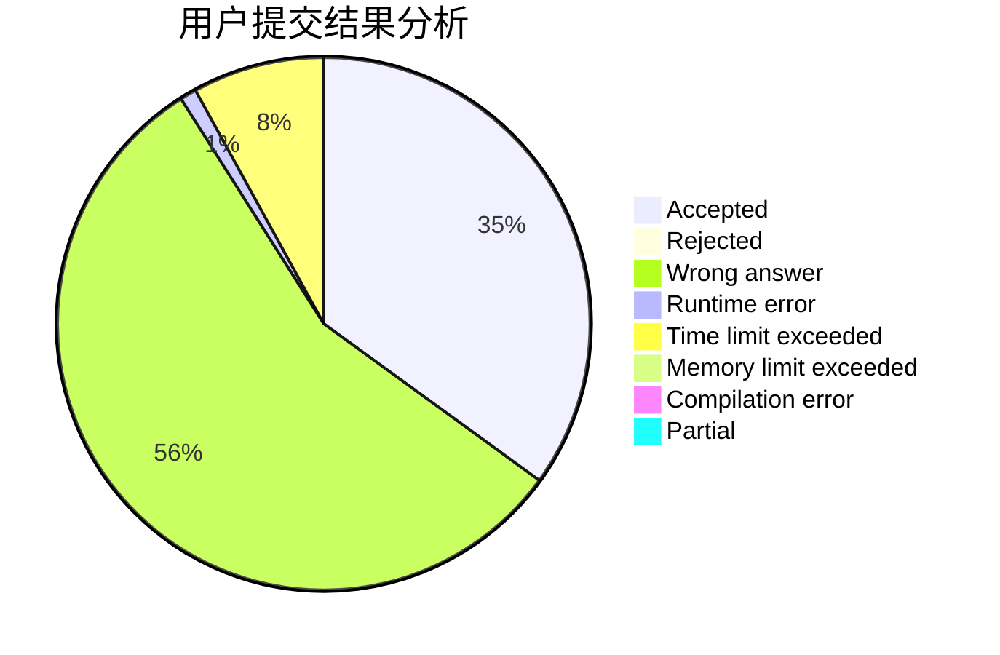
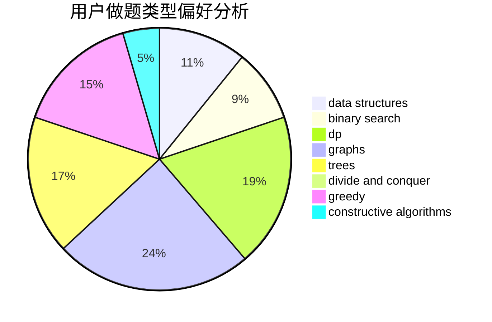
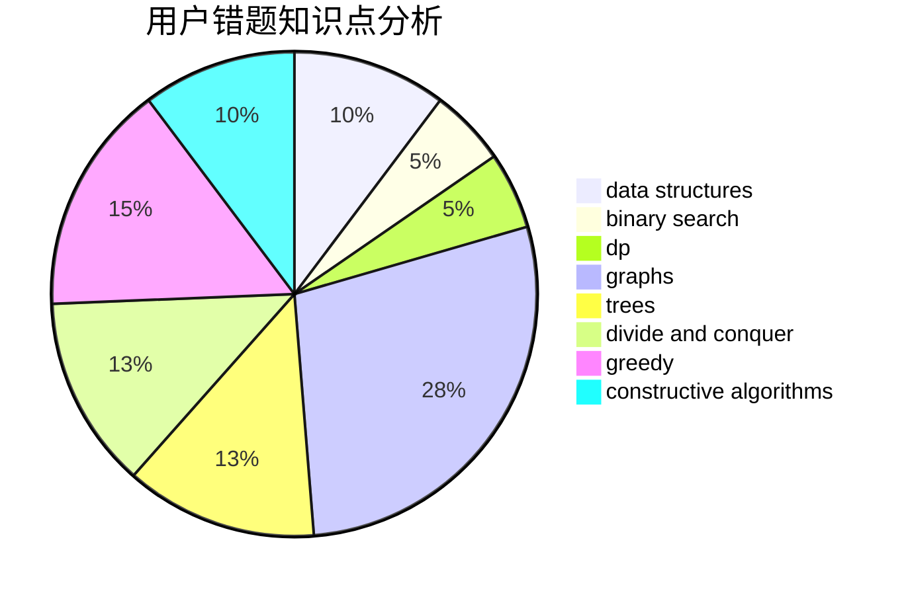

# iceyishandsome

<!-- tabs:start -->

#### **用户提交结果分析**

#### **用户做题类型偏好分析**

#### **用户错题知识点分析**

<!-- tabs:end -->
# 推荐题目
[1117D](https://codeforces.com/contest/1117/problem/D)		dp,
                        math,
                        matrices		  
[899D](https://codeforces.com/contest/899/problem/D)		constructive algorithms,
                        math		  
[515E](https://codeforces.com/contest/515/problem/E)		data structures		  
[577A](https://codeforces.com/contest/577/problem/A)		implementation,
                        number theory		  
[277D](https://codeforces.com/contest/277/problem/D)		dp,
                        probabilities		  
[1145F](https://codeforces.com/contest/1145/problem/F)		nan		  
[936B](https://codeforces.com/contest/936/problem/B)		dfs and similar,
                        dp,
                        games,
                        graphs		  
[652D](https://codeforces.com/contest/652/problem/D)		data structures,
                        sortings		  
[847K](https://codeforces.com/contest/847/problem/K)		greedy,
                        implementation,
                        sortings		  
[666D](https://codeforces.com/contest/666/problem/D)		brute force,
                        geometry		  
