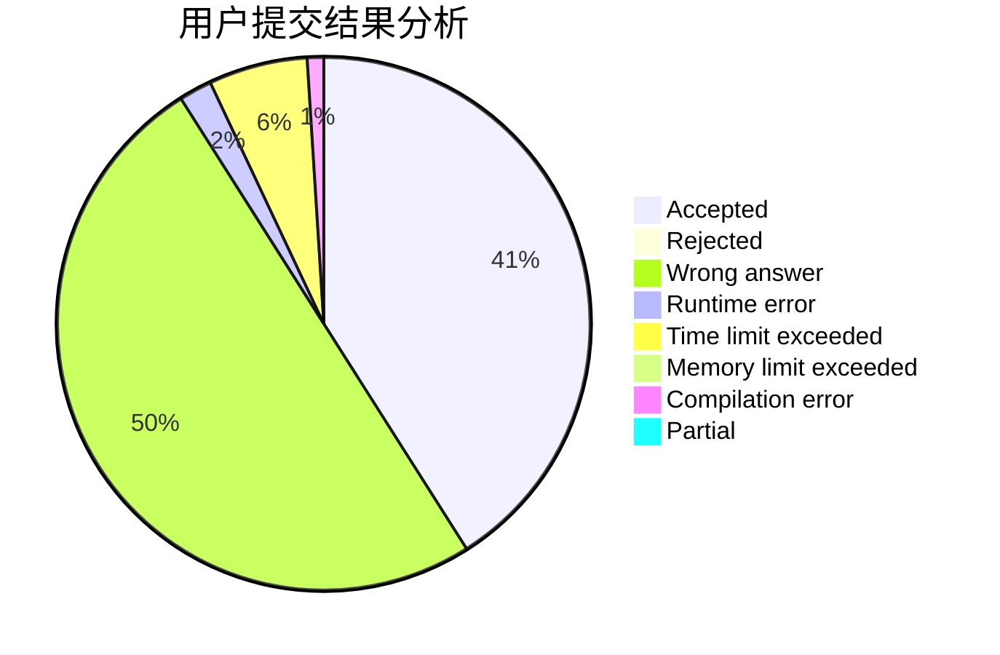
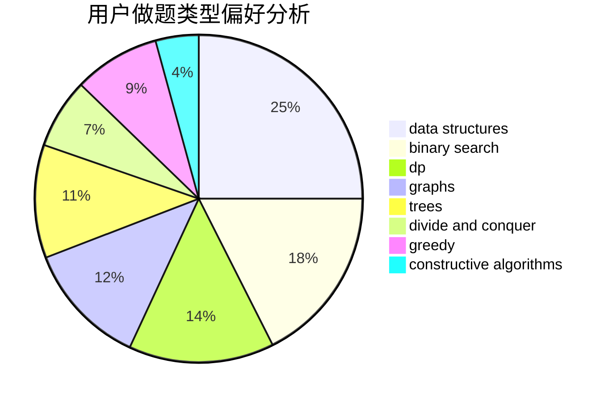

# Bazoka13

<!-- tabs:start -->

#### **用户提交结果分析**

#### **用户做题类型偏好分析**

#### **用户错题知识点分析**

<!-- tabs:end -->
# 推荐题目
[1132F](https://codeforces.com/contest/1132/problem/F)		dp		  
[516C](https://codeforces.com/contest/516/problem/C)		dsu,graphs,sortings,trees		  
[494E](https://codeforces.com/contest/494/problem/E)		data structures,
                        games		  
[462E](https://codeforces.com/contest/462/problem/E)		dsu,graphs,sortings,trees		  
[516B](https://codeforces.com/contest/516/problem/B)		dsu,graphs,sortings,trees		  
[1271F](https://codeforces.com/contest/1271/problem/F)		brute force		  
[1075A](https://codeforces.com/contest/1075/problem/A)		implementation,
                        math		  
[44C](https://codeforces.com/contest/44/problem/C)		implementation		  
[317D](https://codeforces.com/contest/317/problem/D)		dp,
                        games		  
[516A](https://codeforces.com/contest/516/problem/A)		dsu,graphs,sortings,trees		  
