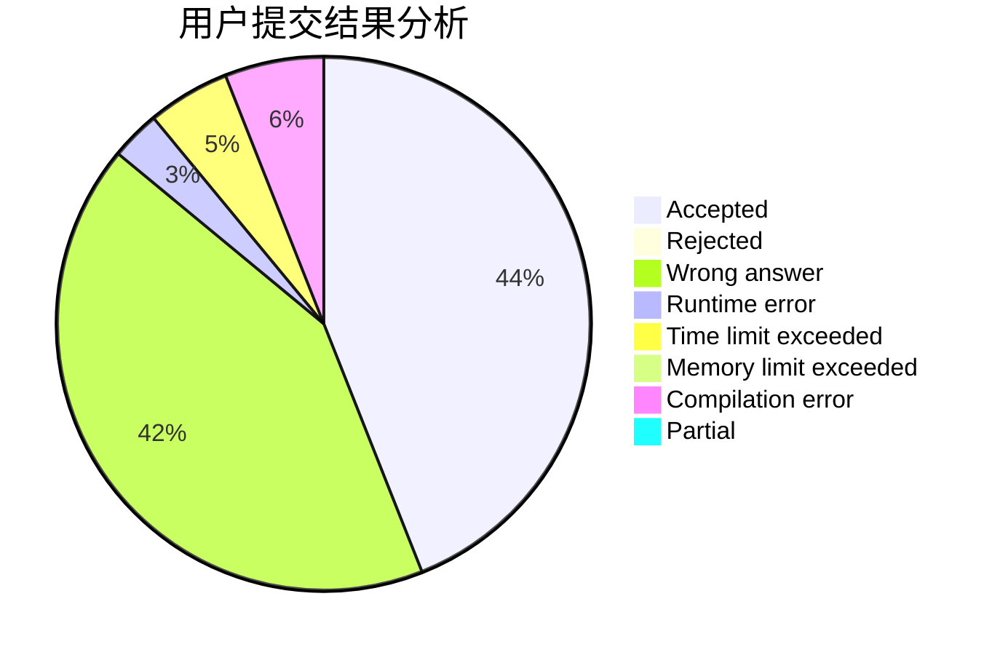
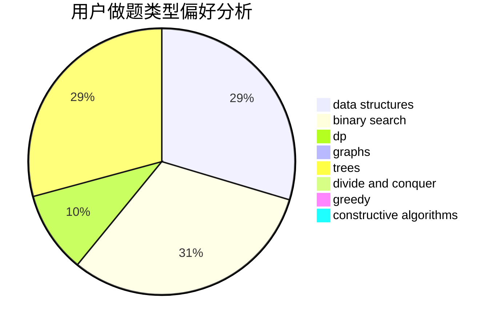
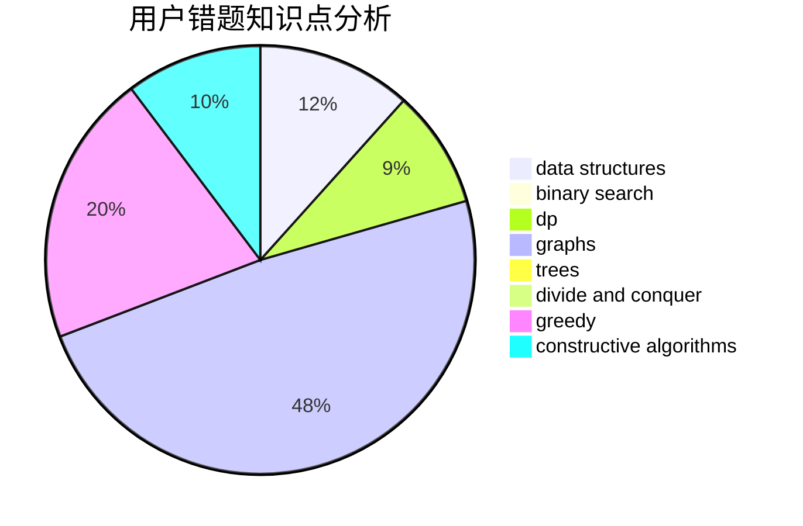

# iceys

<!-- tabs:start -->

#### **用户提交结果分析**

#### **用户做题类型偏好分析**

#### **用户错题知识点分析**

<!-- tabs:end -->
# 推荐题目
[198B](https://codeforces.com/contest/198/problem/B)		shortest paths		  
[53E](https://codeforces.com/contest/53/problem/E)		bitmasks,
                        dp		  
[15C](https://codeforces.com/contest/15/problem/C)		games		  
[1350D](https://codeforces.com/contest/1350/problem/D)		dsu,graphs,sortings,trees		  
[231C](https://codeforces.com/contest/231/problem/C)		binary search,
                        sortings,
                        two pointers		  
[1000B](https://codeforces.com/contest/1000/problem/B)		greedy		  
[1099A](https://codeforces.com/contest/1099/problem/A)		implementation		  
[1091H](https://codeforces.com/contest/1091/problem/H)		games		  
[1238D](https://codeforces.com/contest/1238/problem/D)		binary search,
                        combinatorics,
                        dp,
                        strings		  
[1496D](https://codeforces.com/contest/1496/problem/D)		dsu,graphs,sortings,trees		  
