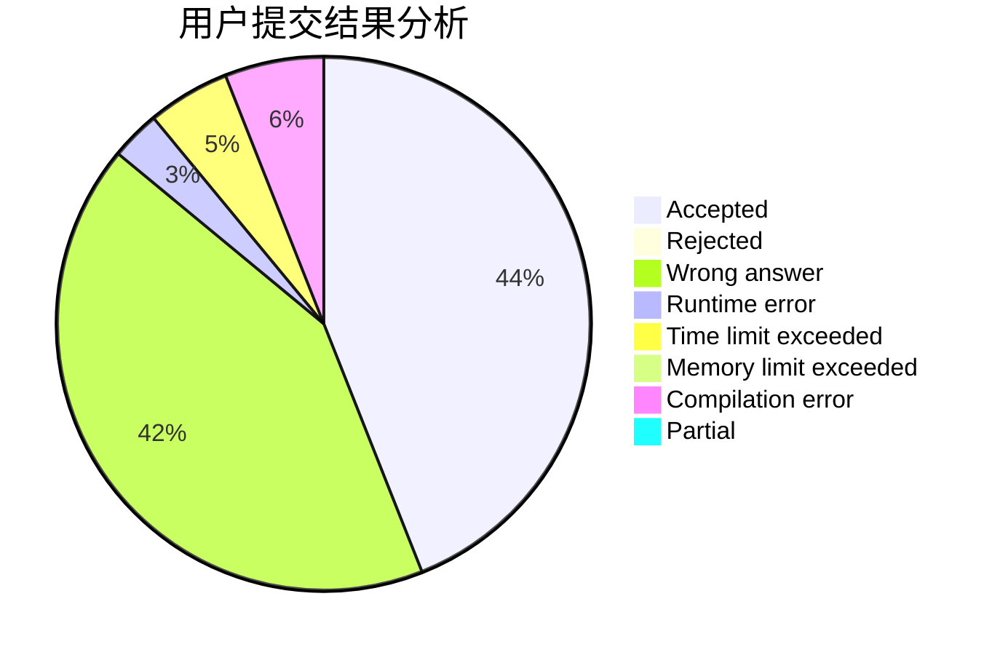
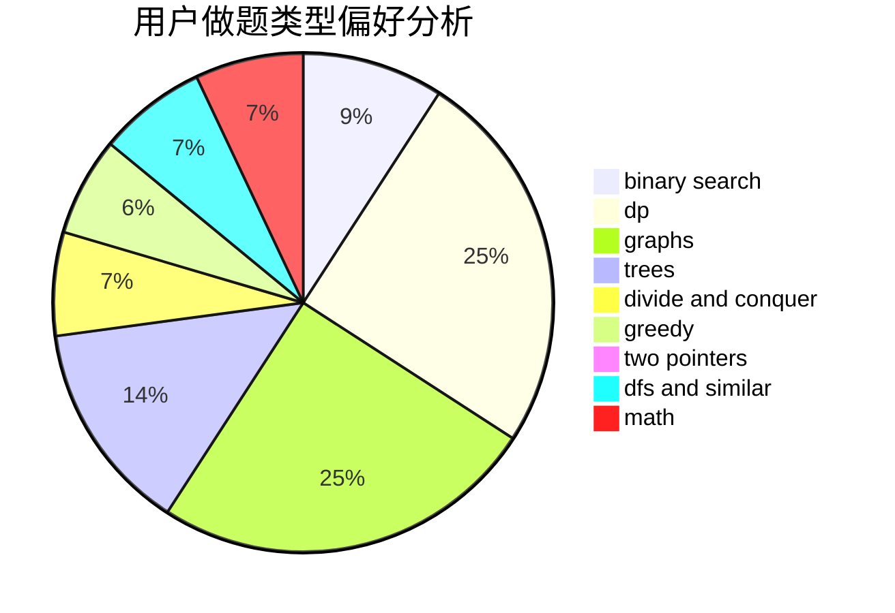

# iceys

<!-- tabs:start -->

#### **用户提交结果分析**

#### **用户做题类型偏好分析**

<!-- tabs:end -->
# 推荐题目
[219D](https://codeforces.com/contest/219/problem/D)
[560E](https://codeforces.com/contest/560/problem/E)
[182D](https://codeforces.com/contest/182/problem/D)
[13577](https://codeforces.com/contest/1357/problem/7)
[253A](https://codeforces.com/contest/253/problem/A)
[1000B](https://codeforces.com/contest/1000/problem/B)
[1099D](https://codeforces.com/contest/1099/problem/D)
[1092A](https://codeforces.com/contest/1092/problem/A)
[1243D](https://codeforces.com/contest/1243/problem/D)
[1505D](https://codeforces.com/contest/1505/problem/D)
