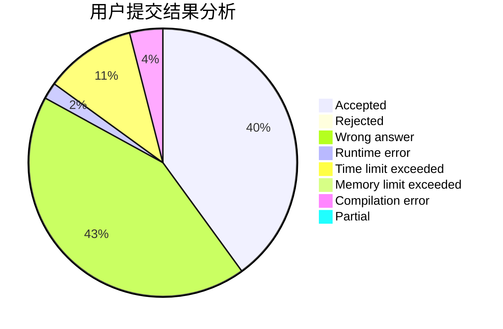
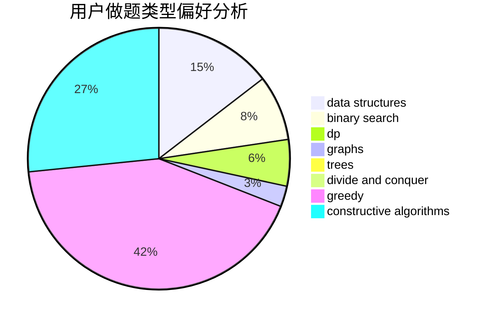
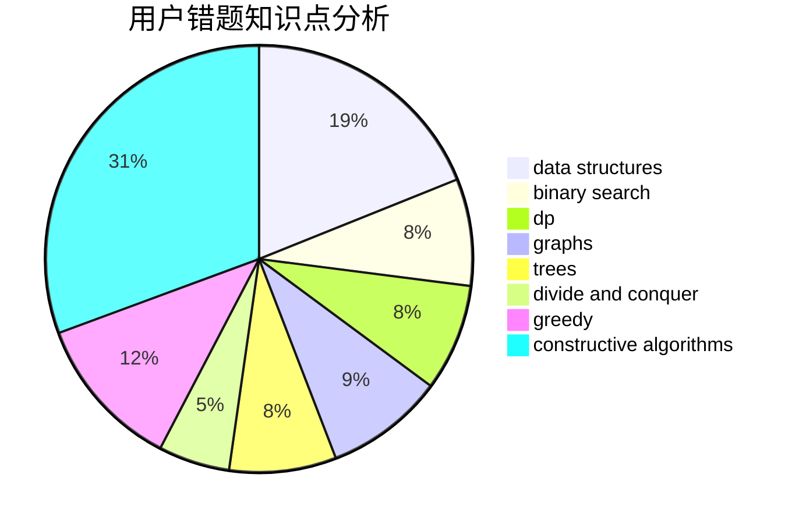

# iclive

<!-- tabs:start -->

#### **用户提交结果分析**

#### **用户做题类型偏好分析**

#### **用户错题知识点分析**

<!-- tabs:end -->
# 推荐题目
[1437E](https://codeforces.com/contest/1437/problem/E)		binary search,
                        constructive algorithms,
                        data structures,
                        dp,
                        implementation		  
[500D](https://codeforces.com/contest/500/problem/D)		combinatorics,
                        dfs and similar,
                        graphs,
                        trees		  
[766D](https://codeforces.com/contest/766/problem/D)		data structures,
                        dfs and similar,
                        dp,
                        dsu,
                        graphs		  
[1304D](https://codeforces.com/contest/1304/problem/D)		constructive algorithms,
                        graphs,
                        greedy,
                        two pointers		  
[1136D](https://codeforces.com/contest/1136/problem/D)		greedy		  
[1092F](https://codeforces.com/contest/1092/problem/F)		dfs and similar,
                        dp,
                        trees		  
[392B](https://codeforces.com/contest/392/problem/B)		dp		  
[626E](https://codeforces.com/contest/626/problem/E)		binary search,
                        math,
                        ternary search		  
[1336D](https://codeforces.com/contest/1336/problem/D)		constructive algorithms,
                        interactive		  
[58E](https://codeforces.com/contest/58/problem/E)		dp		  
