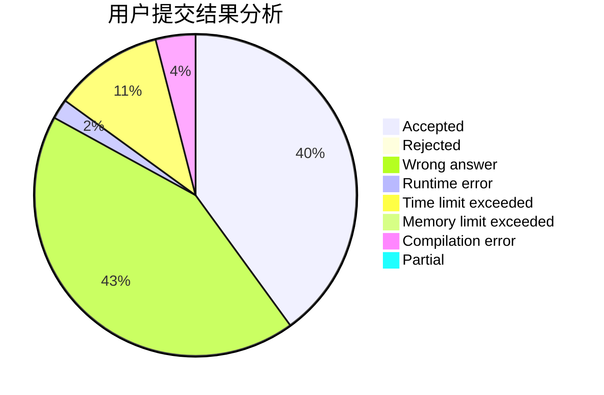
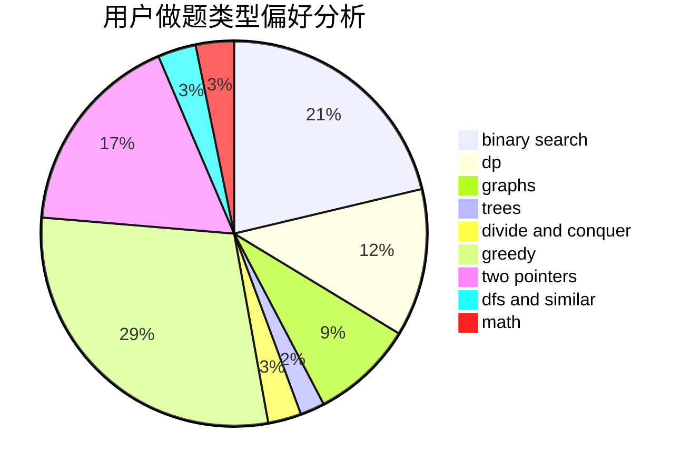

# iclive

<!-- tabs:start -->

#### **用户提交结果分析**

#### **用户做题类型偏好分析**

<!-- tabs:end -->
# 推荐题目
[1447B](https://codeforces.com/contest/1447/problem/B)
[521D](https://codeforces.com/contest/521/problem/D)
[786A](https://codeforces.com/contest/786/problem/A)
[13132](https://codeforces.com/contest/1313/problem/2)
[1138F](https://codeforces.com/contest/1138/problem/F)
[1093C](https://codeforces.com/contest/1093/problem/C)
[421A](https://codeforces.com/contest/421/problem/A)
[652F](https://codeforces.com/contest/652/problem/F)
[1343E](https://codeforces.com/contest/1343/problem/E)
[609E](https://codeforces.com/contest/609/problem/E)
