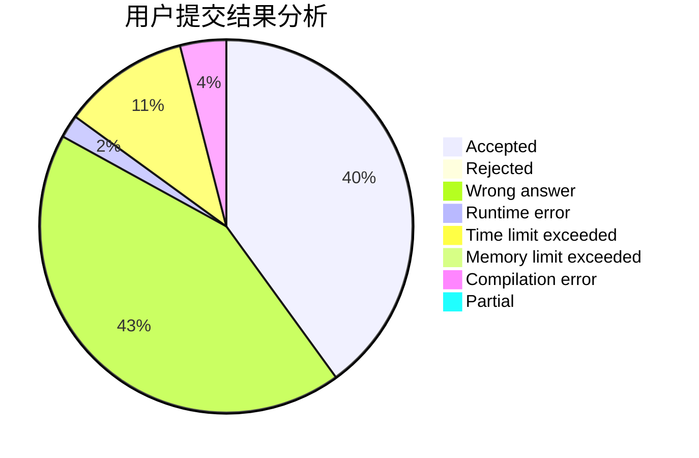
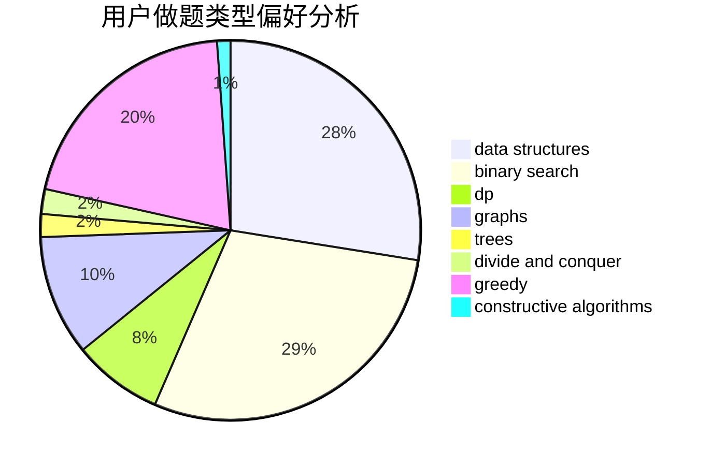
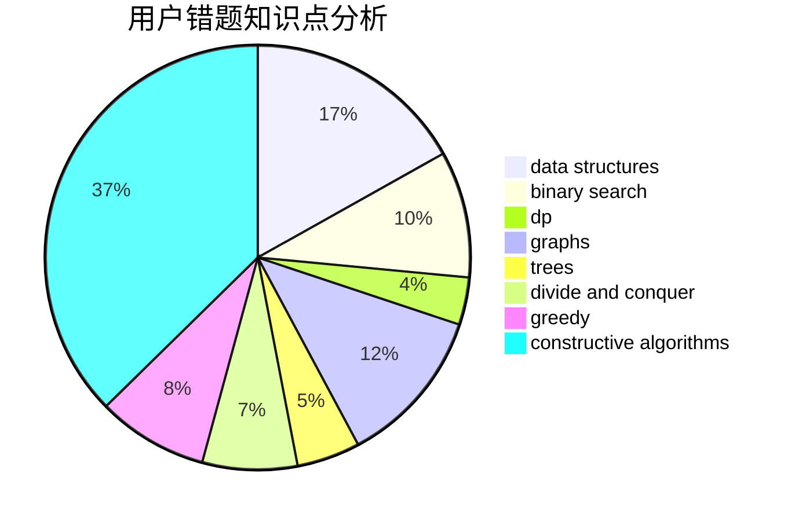

# iclive

<!-- tabs:start -->

#### **用户提交结果分析**

#### **用户做题类型偏好分析**

#### **用户错题知识点分析**

<!-- tabs:end -->
# 推荐题目
[1447B](https://codeforces.com/contest/1447/problem/B)		greedy,
                        math		  
[521D](https://codeforces.com/contest/521/problem/D)		greedy		  
[786A](https://codeforces.com/contest/786/problem/A)		dfs and similar,
                        dp,
                        games		  
[13132](https://codeforces.com/contest/1313/problem/2)		dsu,graphs,sortings,trees		  
[1138F](https://codeforces.com/contest/1138/problem/F)		dsu,graphs,sortings,trees		  
[1093C](https://codeforces.com/contest/1093/problem/C)		greedy		  
[421A](https://codeforces.com/contest/421/problem/A)		constructive algorithms,
                        implementation		  
[652F](https://codeforces.com/contest/652/problem/F)		constructive algorithms,
                        math		  
[1343E](https://codeforces.com/contest/1343/problem/E)		brute force,
                        graphs,
                        greedy,
                        shortest paths,
                        sortings		  
[609E](https://codeforces.com/contest/609/problem/E)		data structures,
                        dfs and similar,
                        dsu,
                        graphs,
                        trees		  
