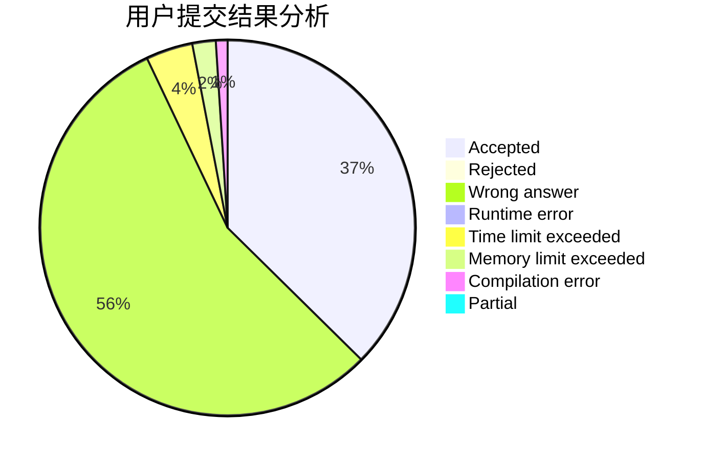
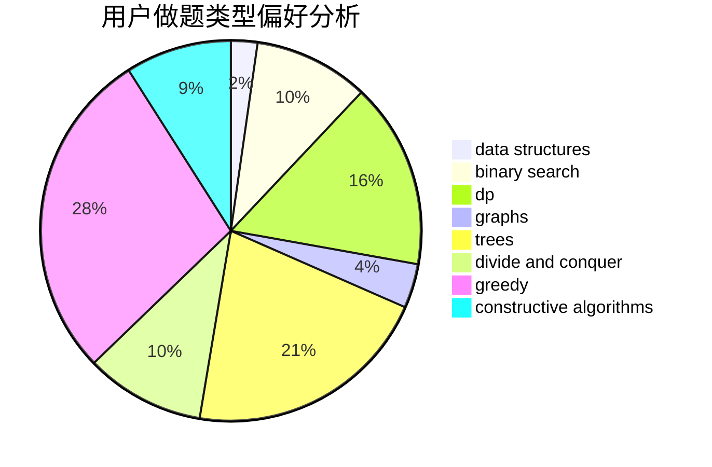

# ig-Rookie

<!-- tabs:start -->

#### **用户提交结果分析**

#### **用户做题类型偏好分析**

#### **用户错题知识点分析**

<!-- tabs:end -->
# 推荐题目
[425E](https://codeforces.com/contest/425/problem/E)		dp		  
[1079C](https://codeforces.com/contest/1079/problem/C)		dsu,graphs,sortings,trees		  
[1029F](https://codeforces.com/contest/1029/problem/F)		binary search,
                        brute force,
                        math,
                        number theory		  
[529B](https://codeforces.com/contest/529/problem/B)		brute force,
                        greedy,
                        sortings		  
[848B](https://codeforces.com/contest/848/problem/B)		constructive algorithms,
                        data structures,
                        geometry,
                        implementation,
                        sortings,
                        two pointers		  
[656F](https://codeforces.com/contest/656/problem/F)		*special problem		  
[1510G](https://codeforces.com/contest/1510/problem/G)		nan		  
[1089M](https://codeforces.com/contest/1089/problem/M)		constructive algorithms,
                        graphs		  
[663E](https://codeforces.com/contest/663/problem/E)		dsu,graphs,sortings,trees		  
[1012C](https://codeforces.com/contest/1012/problem/C)		dp		  
