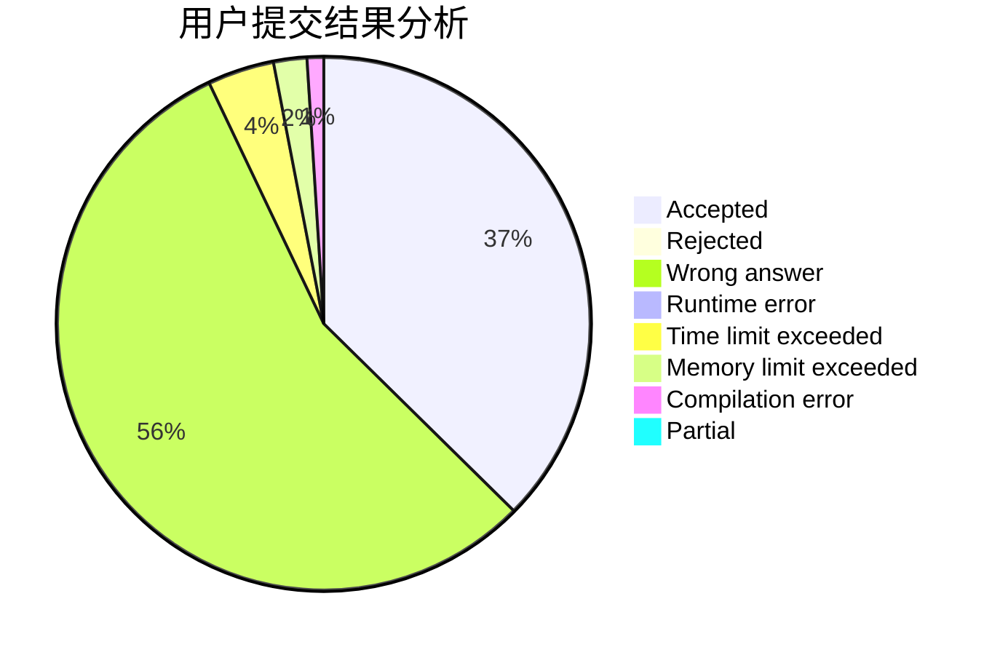
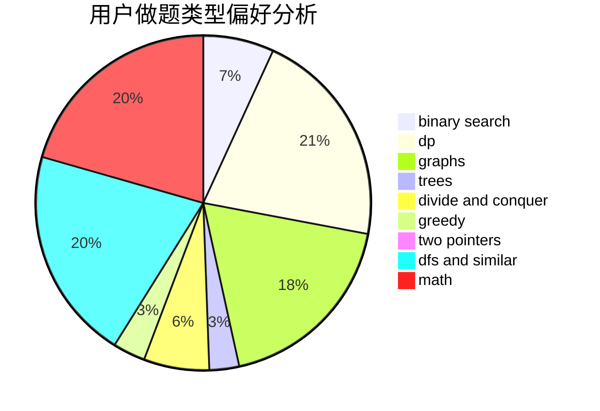

# ig-Rookie

<!-- tabs:start -->

#### **用户提交结果分析**

#### **用户做题类型偏好分析**

<!-- tabs:end -->
# 推荐题目
[449C](https://codeforces.com/contest/449/problem/C)
[107B](https://codeforces.com/contest/107/problem/B)
[1030A](https://codeforces.com/contest/1030/problem/A)
[553A](https://codeforces.com/contest/553/problem/A)
[866E](https://codeforces.com/contest/866/problem/E)
[678F](https://codeforces.com/contest/678/problem/F)
[165D](https://codeforces.com/contest/165/problem/D)
[1090B](https://codeforces.com/contest/1090/problem/B)
[683A](https://codeforces.com/contest/683/problem/A)
[1013A](https://codeforces.com/contest/1013/problem/A)
