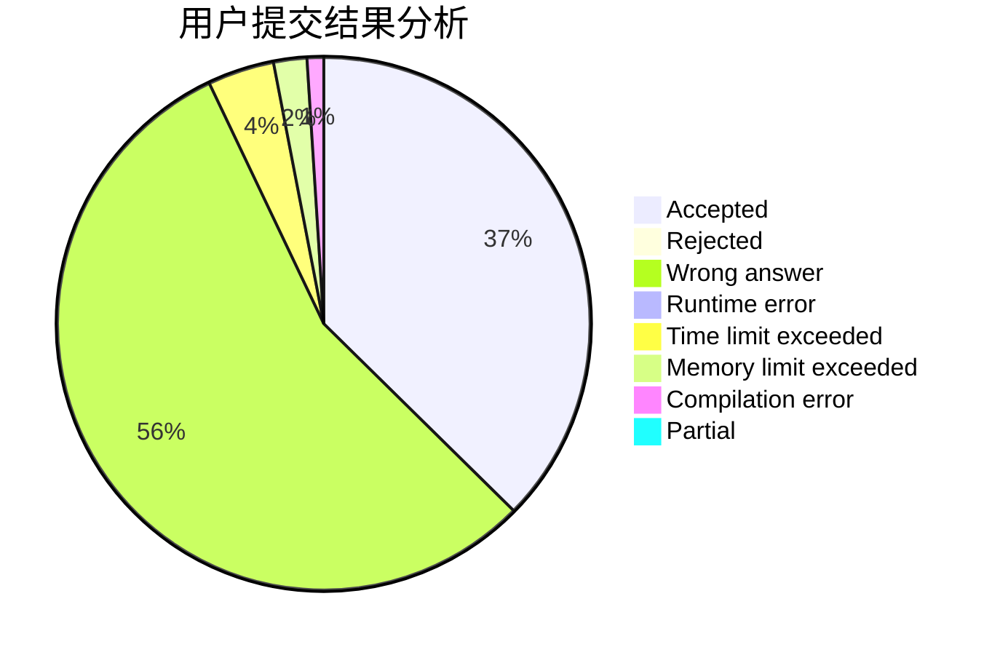
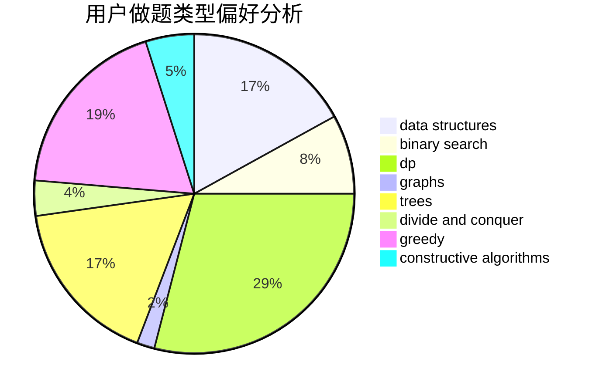

# ig-Rookie

<!-- tabs:start -->

#### **用户提交结果分析**

#### **用户做题类型偏好分析**

#### **用户错题知识点分析**

<!-- tabs:end -->
# 推荐题目
[449C](https://codeforces.com/contest/449/problem/C)		constructive algorithms,
                        number theory		  
[107B](https://codeforces.com/contest/107/problem/B)		combinatorics,
                        dp,
                        math,
                        probabilities		  
[1030A](https://codeforces.com/contest/1030/problem/A)		implementation		  
[553A](https://codeforces.com/contest/553/problem/A)		combinatorics,
                        dp,
                        math		  
[866E](https://codeforces.com/contest/866/problem/E)		dsu,graphs,sortings,trees		  
[678F](https://codeforces.com/contest/678/problem/F)		data structures,
                        divide and conquer,
                        geometry		  
[165D](https://codeforces.com/contest/165/problem/D)		data structures,
                        dsu,
                        trees		  
[1090B](https://codeforces.com/contest/1090/problem/B)		nan		  
[683A](https://codeforces.com/contest/683/problem/A)		*special problem,
                        geometry		  
[1013A](https://codeforces.com/contest/1013/problem/A)		math		  
