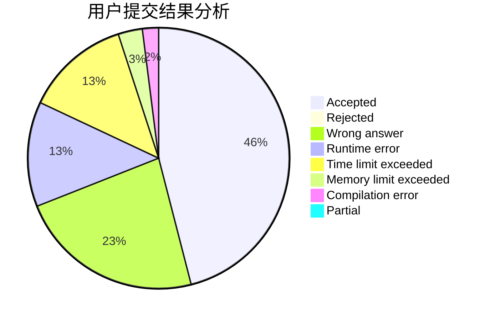
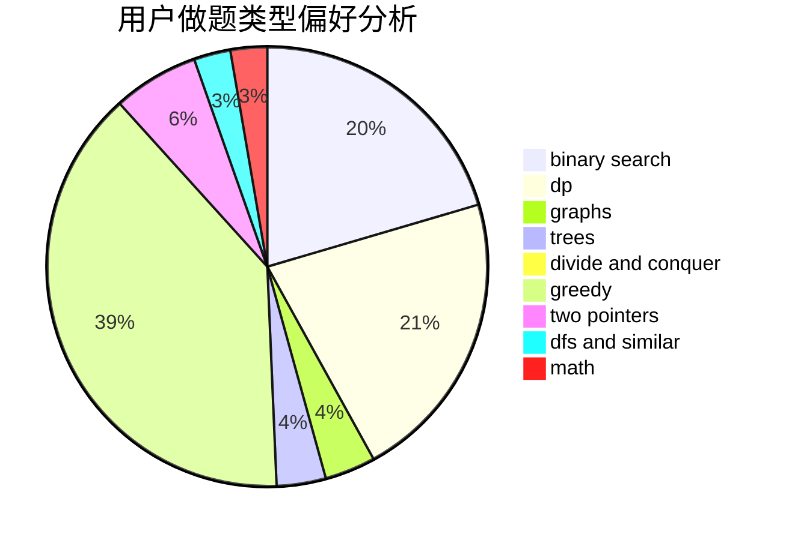

# ig-TheShy

<!-- tabs:start -->

#### **用户提交结果分析**

#### **用户做题类型偏好分析**

<!-- tabs:end -->
# 推荐题目
[9E](https://codeforces.com/contest/9/problem/E)
[1401B](https://codeforces.com/contest/1401/problem/B)
[57D](https://codeforces.com/contest/57/problem/D)
[601B](https://codeforces.com/contest/601/problem/B)
[166A](https://codeforces.com/contest/166/problem/A)
[4A](https://codeforces.com/contest/4/problem/A)
[1154E](https://codeforces.com/contest/1154/problem/E)
[509A](https://codeforces.com/contest/509/problem/A)
[1099D](https://codeforces.com/contest/1099/problem/D)
[1055B](https://codeforces.com/contest/1055/problem/B)
