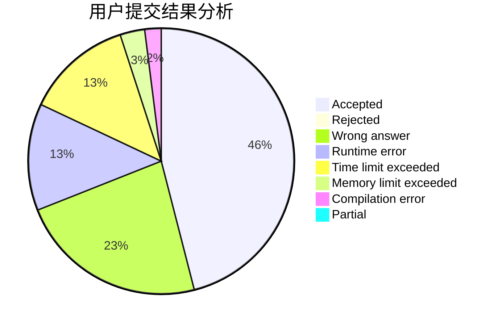
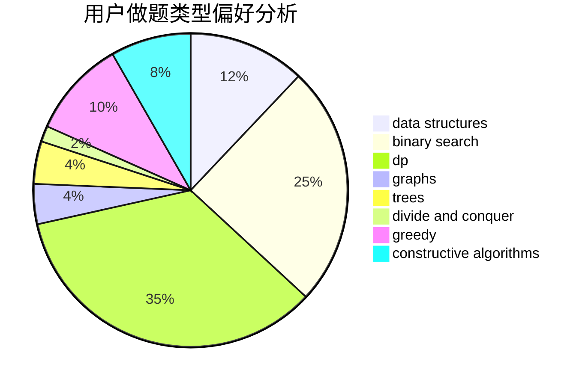
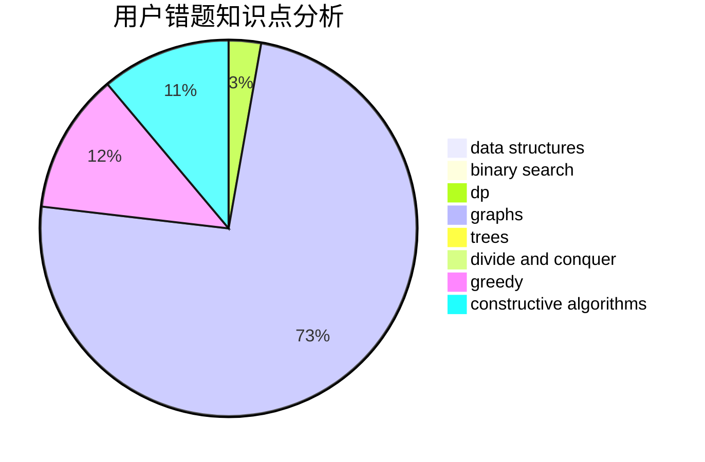

# ig-TheShy

<!-- tabs:start -->

#### **用户提交结果分析**

#### **用户做题类型偏好分析**

#### **用户错题知识点分析**

<!-- tabs:end -->
# 推荐题目
[9E](https://codeforces.com/contest/9/problem/E)		dfs and similar,
                        dsu,
                        graphs		  
[1401B](https://codeforces.com/contest/1401/problem/B)		constructive algorithms,
                        greedy,
                        math		  
[57D](https://codeforces.com/contest/57/problem/D)		dp,
                        math		  
[601B](https://codeforces.com/contest/601/problem/B)		data structures,
                        math		  
[166A](https://codeforces.com/contest/166/problem/A)		binary search,
                        implementation,
                        sortings		  
[4A](https://codeforces.com/contest/4/problem/A)		brute force,
                        math		  
[1154E](https://codeforces.com/contest/1154/problem/E)		data structures,
                        implementation,
                        sortings		  
[509A](https://codeforces.com/contest/509/problem/A)		brute force,
                        implementation		  
[1099D](https://codeforces.com/contest/1099/problem/D)		dsu,graphs,sortings,trees		  
[1055B](https://codeforces.com/contest/1055/problem/B)		dsu,
                        implementation		  
