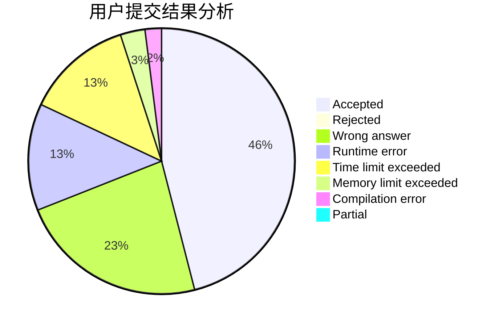
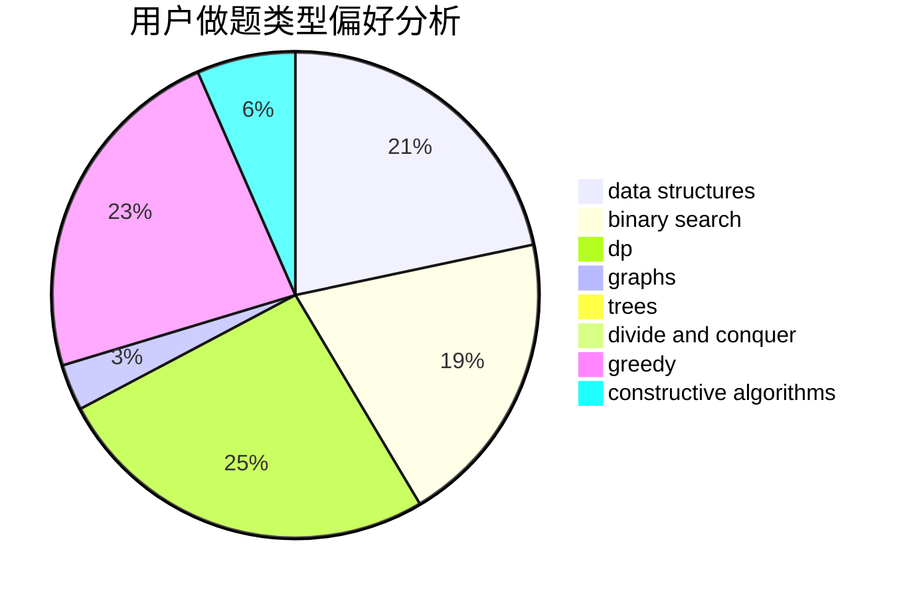
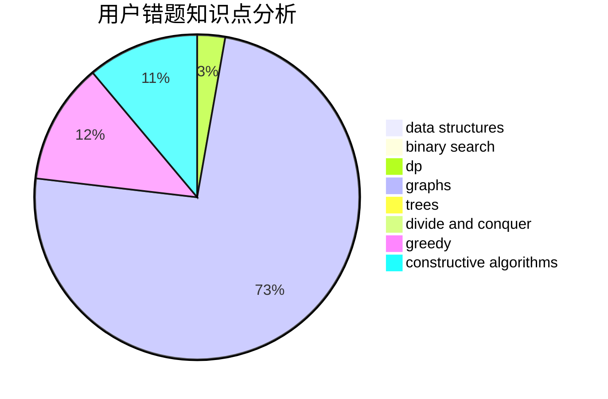

# ig-TheShy

<!-- tabs:start -->

#### **用户提交结果分析**

#### **用户做题类型偏好分析**

#### **用户错题知识点分析**

<!-- tabs:end -->
# 推荐题目
[985D](https://codeforces.com/contest/985/problem/D)		binary search,
                        constructive algorithms,
                        math		  
[1393C](https://codeforces.com/contest/1393/problem/C)		constructive algorithms,
                        greedy,
                        math,
                        sortings		  
[555C](https://codeforces.com/contest/555/problem/C)		data structures		  
[581A](https://codeforces.com/contest/581/problem/A)		implementation,
                        math		  
[1510I](https://codeforces.com/contest/1510/problem/I)		greedy,
                        interactive,
                        math,
                        probabilities		  
[479E](https://codeforces.com/contest/479/problem/E)		combinatorics,
                        dp		  
[1152E](https://codeforces.com/contest/1152/problem/E)		constructive algorithms,
                        dfs and similar,
                        graphs		  
[489A](https://codeforces.com/contest/489/problem/A)		greedy,
                        implementation,
                        sortings		  
[1099A](https://codeforces.com/contest/1099/problem/A)		implementation		  
[1054G](https://codeforces.com/contest/1054/problem/G)		constructive algorithms,
                        greedy,
                        math		  
